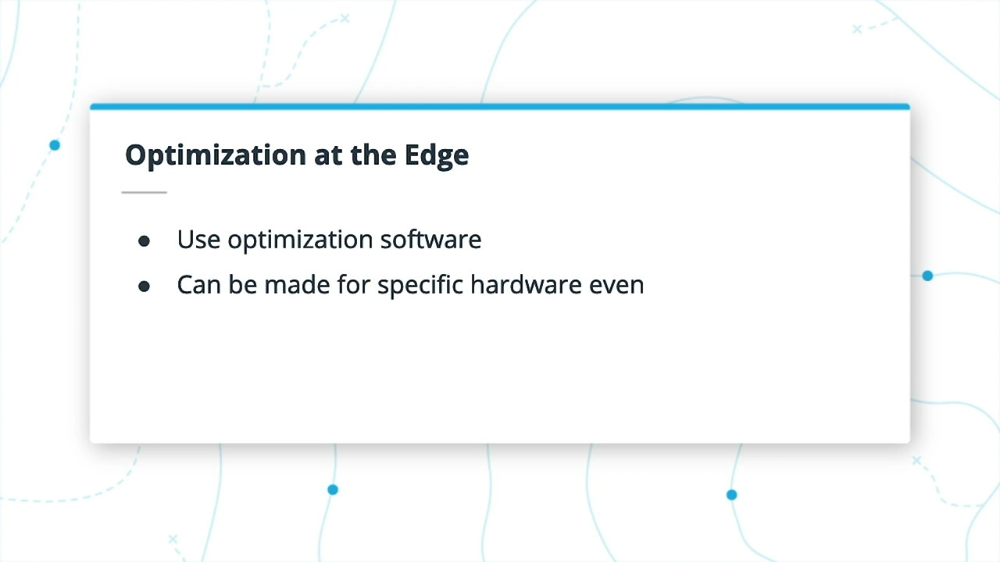
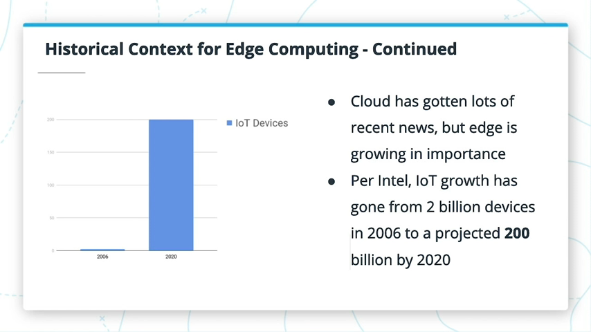

# 1 Introduction to AI at the Edge

## 1.1 Instructor Intro
欢迎参加本课程！ 
- 我们首先将简要介绍Edge上的AI，其重要性，不同的边缘应用程序以及其背后的一些历史。 
- 在这里，我将带您了解课程结构，
- 课程主题之间的相互关系，
- 相关工具和前提条件，
- 然后在课程结束时快速浏览要做的项目。

## 1.2 What is AI at the Edge?

边缘意味着本地（或接近本地）处理，而不是云中的任何地方。 这可以是实际的本地设备，例如智能冰箱，也可以是尽可能靠近源的服务器（即，位于附近区域而不是位于世界另一端的服务器）。

边缘可用于需要低延迟或网络本身可能不总是可用的地方。 它的使用可能来自对某些应用程序中实时决策的需求。

许多使用云的应用程序都在本地获取数据，将数据发送到云，进行处理，然后再发送回去。

边缘意味着无需发送到云； 它通常可以更安全（取决于边缘设备的安全性），并且对网络的影响较小。Edge AI算法仍然可以在云中进行训练，但是可以在边缘运行。

- 大多数语音助手会将您的查询发送到云进行处理，
- 而大多数自动驾驶汽车都需要能够在边缘执行其计算。 
- 从数百万笔销售交易中收集见解可能适合使用云中可用的高级计算，
- 远程自然摄像机可能无法始终通过连接发送其数据。

## 1.3 Why is AI at the Edge Important?

- 网络通信可能会很昂贵（带宽，功耗等），有时甚至是不可能的（想想偏远地区或自然灾害期间）
  
  
- 对于诸如自动驾驶汽车之类的应用而言，实时处理是必不可少的，因为对重要问题的决策处理不能有延迟
  
  
- 边缘应用程序可能正在使用个人数据（例如健康数据），如果将这些数据发送到云，可能会很敏感。
  
  
- 优化软件（特别是针对特定硬件而设计）可以通过边缘AI模型帮助实现高效率
  
  

## 1.4 Applications of AI at the Edge

- 边缘几乎有无限的可能性。
- 物联网设备是边缘的一大用途。
- 并非每个应用程序都需要它-您可能需要等待一秒钟，而您的语音应用程序会向服务器询问问题
- 或者当NASA工程师正在处理最新的黑洞数据时。

## 1.5 Historical Context

- 近年来，云计算获得了很多新闻，但是边缘也在变得越来越重要。
- 根据英特尔®，物联网的增长已从2006年的20亿台设备增长到2020年的2000亿台。
- 从1970年代的第一台网络ATM机到90年代的万维网，再到2000年代初的智能电表，我们已经走了很长一段路。
- 从电话等不断使用的设备到智能扬声器，智能冰箱，锁，仓库应用程序等，物联网池不断扩大。

## 1.6 Course Structure

- 在本课程中，我们将主要使用 [Intel® Distribution of OpenVINO™ Toolkit](https://software.intel.comexercise/en-us/openvino-toolkit) 在Edge上专注于AI。

- 首先，我们将从`OpenVINO™Open Model Zoo`中可用的预训练模型开始。 即使不需要大量的数据和昂贵的训练，您也可以部署已经为许多应用程序创建的强大模型。
- 接下来，您将了解模型优化器，该模型优化器可以采用在TensorFlow，PyTorch，Caffe等框架中训练过的模型，**并创建经过优化的中间表示（IR）**，以使用OpenVINO™和英特尔®硬件进行推理。
- 第三，您将了解推理引擎，其中实际推理是在IR模型上执行的。
- 最后，我们将讨论有关在边缘进行部署的更多主题，包括处理输入流，处理模型输出以及用于将数据从边缘模型发布到Web的轻量级MQTT体系结构。

## 1.7 Why Are the Topics Distinct?

- 可以使用预先训练的模型来探索您的选择，而无需训练模型。然后，该预训练模型可以与推理引擎一起使用，因为**它已经是IR格式**。可以将其集成到您的应用中并部署在边缘。

如果您创建了自己的模型，或者正在使用尚未采用IR格式的模型（TensorFlow，PyTorch，Caffe，MXNet等），请首先使用模型优化器。 然后，这将馈送到推理引擎，该引擎可以集成到您的应用中并部署在边缘。

尽管您可以在将推理引擎输入到推理引擎后执行一些令人惊奇的高效推理，但是您仍然想要适当地处理边缘应用程序的输出，这就是我们在最后一课中要介绍的内容。

## 1.8 Relevant Tools and Prerequisites

总结
- 先决条件：
  - 了解计算机视觉的一些基础知识以及如何创建AI模型。
  - 基本的Python或C++经验。 尽管C ++可以很容易地与 Intel® Distribution of OpenVINO™ Toolkit 一起使用（并且在完整的应用程序中可以更快！），但第一门课程主要是关于Python的。
- 我们不会在本课程中训练模型，因为我们的重点是边缘的优化和部署。
- 课堂工作区将可用于练习，因此如果您打算使用它们，则无需进行设置。

本地设置
- 如果要在本地工作，请确保记下 Intel® Distribution of OpenVINO™ 的[硬件要求](https://software.intel.comexercise/en-us/openvino-toolkit/hardware)。
- 如果您确实想在本地计算机上进行练习（甚至可能在带有[Intel®Neural Compute Stick 2](https://software.intel.comexercise/en-us/articles/intel-neural-compute-stick-2-and-open-source-openvino-toolkit)的Raspberry Pi等设置上进行练习），则可以按照以下操作系统说明进行操作。
- Serial number : CZL3-GNXWDJCW
  
注意：本课程的教室工作区使用该工具包的2019 R3版本，因此较新版本的语法可能有所不同。

英特尔®DevCloud-Edge
- 还有新的英特尔®DevCloud平台可用于测试边缘环境。这使您可以访问一系列英特尔®硬件，例如CPU，GPU，FPGA，神经计算棒等。以后的课程将更多地涉及硬件方面，但这是与边缘环境一起工作的另一种选择。

## 1.9 What You Will Build

在课程结束时的项目中，您将在Edge上构建和部署People Counter App。在项目中，您将：
- 将模型转换为中间表示（IR）
- 将IR与推理引擎一起使用
- 处理模型的输出以收集相关统计信息
- 将这些统计信息发送到服务器，
- 并对性能和进一步进行分析您模型的用例。

项目演示
- 在下面，您可以找到有关项目运行的快速视频演示，并返回有关框架中的人数，框架中平均花费的时间以及到目前为止所统计的人数的统计信息。所有这些都从边缘应用程序发送到Web服务器。请注意，没有与此应用程序关联的音频。

## 1.10 Recap

总结

在这一入门课程中，我们介绍了：
- 边缘的基础知识
- 边缘的重要性及其历史
- 边缘应用程序
- 课程结构
  - 预训练模型
  - 模型优化器
  - 推理引擎
  - 更多边缘主题（MQTT，服务器等）。
  - 项目概述

接下来，我们将开始研究预训练的模型以及它们对Edge应用程序的帮助，从而拉开序幕。