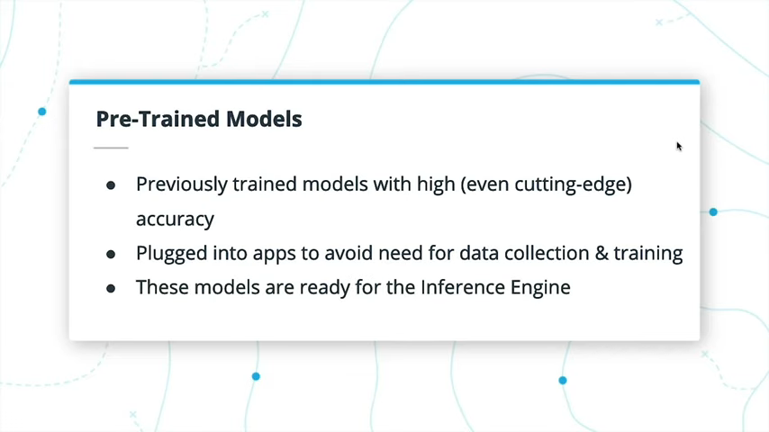
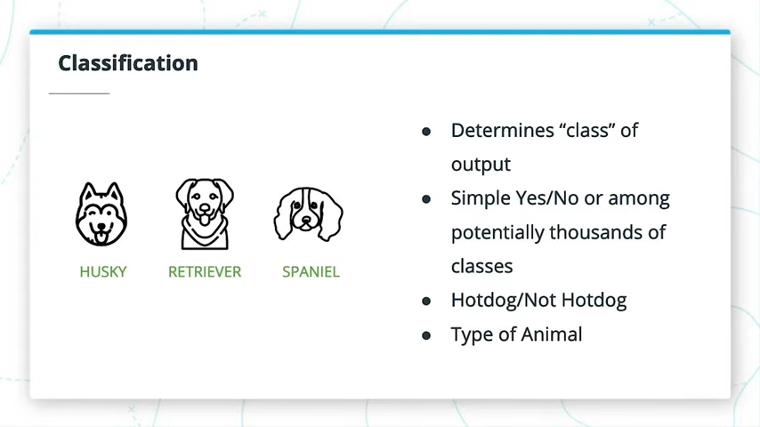
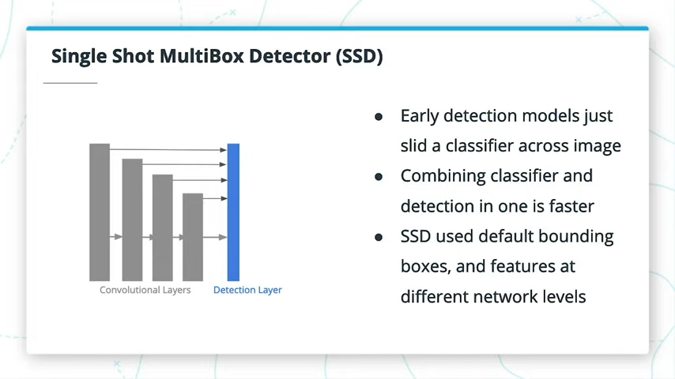
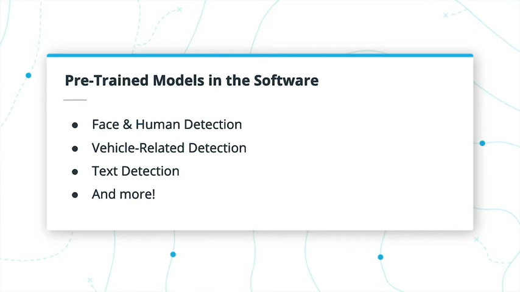

# 2 Leveraging Pre-Trained Models

## 2.1 Introduction

在本课程中，我们将介绍：
- Intel® Distribution OpenVINO™ Toolkit 的基础
- 不同的计算机视觉模型类型
- 软件中可用的预训练模型
- 为您的应用选择正确的预训练模型
- 加载和部署具有预训练模型的基本应用

## 2.2 The OpenVINO™ Toolkit


OpenVINO™工具包的名称来自“开放式视觉推理和神经网络优化 **O**pen **V**isual **I**nferencing and Neural **N**etwork **O**ptimization”。 它主要集中在优化神经网络推理上，并且是开源的。

它是由英特尔®开发的，并通过通用API帮助支持跨英特尔®CPU，GPU，FPGA和神经计算棒的快速推理。OpenVINO™可以采用由多个不同框架（例如TensorFlow或Caffe）构建的模型，并使用其Model Optimizer进行推理优化。然后，可以将这种优化的模型与推理引擎一起使用，这有助于加快对相关硬件的推理。它还具有通过Model Optimizer进行的各种预训练模型。


通过优化模型速度和尺寸，OpenVINO™可以在边缘运行。这**并不意味着推理精度会提高-这需要事先进行训练**。OpenVINO™生成的更小，更快的模型，以及它提供的硬件优化，非常适合资源较少的应用。例如，物联网设备没有多个GPU和无限内存空间来运行其应用程序的优势。


## 2.3 Pre-Trained Models in OpenVINO™



通常，预训练模型是指已经进行训练的模型，通常具有很高的精度甚至是最前沿的精度。使用预训练的模型避免了大规模数据收集和长期，昂贵的训练的需要。在掌握了如何预处理输入和处理网络输出的知识之后，您可以将其直接插入自己的应用程序中。

在OpenVINO™中，预训练模型专门指的是Model Zoo，其中的免费模型集包含**已经使用Model Optimizer转换的预训练模型**。这些模型可以直接与推理引擎一起使用。


进一步的研究
- 我们将很快返回OpenVINO™Toolkit可用的各种经过预先训练的模型，但是您可以通过阅读这里的文档来抢先一步。

## 2.4 Types of Computer Vision Models

我们在视频中介绍了三种类型的计算机视觉模型：分类，检测和细分。



分类从简单的是/否到数千个类确定图像或图像中的对象所属的给定“类”。这些通常按类别具有某种“概率”，因此，最高的概率是确定的类别，但是您也可以看到前5个预测。


检测涉及确定对象出现在图像的不同位置，并且通常在检测到的对象周围绘制边界框 它通常还具有某种形式的分类，可以确定给定边界框中的对象的类别。边界框具有置信度阈值，因此您可以排除低置信度检测。


分割通过对每个像素进行分类来对图像的各个部分进行分类。这些网络通常以某种方式进行后处理，以避免在这里和那里出现幻像类。


分割分为语义分割和实例分割两个子集
- 第一个实例将类的所有实例视为一个实例，
- 而第二个实例实际上将相同类的实例视为单独的对象。


## 2.5 Case Studies in Computer Vision

视频中我们专注于SSD，ResNet和MobileNet。
- SSD是一个对象检测网络，通过在不同网络层使用默认边界框将分类与对象检测结合在一起。
  
  

- ResNet利用残差层在层的各个部分上“跳过”，从而有助于避免使用非常深的神经网络消失的梯度问题。  
  - 关于ResNet体系结构的另一条​​注释-该论文本身实际上在理论上认为，非常深的神经网络由于**收敛速度呈指数降低而具有收敛问题，而不仅仅是消失的梯度问题**。还认为消失的梯度问题可以通过使用对每个不同层的输入归一化来解决，这不是ResNet特有的。与没有残留层的“普通”网络相比，在训练过程中，具有多个不同层数的ResNet体系结构本身的**收敛速度更快**。
  
  

- MobileNet利用1x1卷积之类的层来帮助降低计算复杂性和网络规模，从而在不大幅降低准确性的情况下实现快速推理。

  


ResNet帮助打开了比以前更深入的神经网络的大门。“跳过”层帮助神经网络避免了深度网络中不会出现的梯度消失问题。

进一步的研究
- 习惯于阅读研究论文是与AI和Computer Vision一起工作时建立的一项关键技能。 在下面，您可以找到我们在本节中讨论的某些网络上的原始研究论文。
  - [SSD](https://arxiv.org/abs/1512.02325)
  - [YOLO](https://arxiv.org/abs/1506.02640)
  - [Faster RCNN](https://arxiv.org/abs/1506.01497)
  - [MobileNet](https://arxiv.org/abs/1704.04861)
  - [ResNet](https://arxiv.org/abs/1512.03385)
  - [Inception](https://arxiv.org/pdf/1409.4842.pdf)

## 2.6 Available Pre-Trained Models in OpenVINO™



OpenVINO™提供的大多数预训练模型都属于面部检测，人体检测或与车辆相关的检测。 还有一个用于检测文本的模型，还有更多！


Public Model Set中的模型仍然必须通过Model Optimizer运行，但是要使用其原始模型进行进一步的训练和微调。免费模型集已转换为中间表示格式，并且没有原始模型可用。这些可以通过OpenVINO™随附文件中提供的Model Downloader工具轻松获得。


我们之前讨论的SSD和MobileNet架构通常是许多模型所使用架构的主要部分。


您可以在此处查看英特尔®OpenVINO™发行版中提供的预训练模型的完整[列表](https://software.intel.com/en-us/openvino-toolkit/documentation/pretrained-models)。 在下一课程中，当我们进入模型优化器时，您会发现很容易将其他来源的预训练模型用于OpenVINO™。

## 2.7 Exercise: Loading Pre-Trained Models

[Guide.ipynb](./exercises/Guide.ipynb)

```sh
1  pip install requests pyyaml -t /usr/local/lib/python3.5/dist-packages && clear && source /opt/intel/openvino/bin/setupvars.sh -pyver 3.5
4  cd /opt/intel/openvino/deployment_tools/open_model_zoo/tools/downloader/
8  ./downloader.py -h
10  ./downloader.py --name human-pose-estimation-0001 -o /home/workspace/
11  ./downloader.py --name text-detection-0004 --precisions FP16 -o /home/workspace/
12  ./downloader.py --name vehicle-attributes-recognition-barrier-0039 --precisions INT8 -o /home/workspace/
```
```sh
(venv) root@ecd7857385ad:/opt/intel/openvino/deployment_tools/open_model_zoo/tools/downloader# tree /home/workspace/intel/
/home/workspace/intel/
├── human-pose-estimation-0001
│   ├── FP16
│   │   ├── human-pose-estimation-0001.bin
│   │   └── human-pose-estimation-0001.xml
│   ├── FP32
│   │   ├── human-pose-estimation-0001.bin
│   │   └── human-pose-estimation-0001.xml
│   └── INT8
│       ├── human-pose-estimation-0001.bin
│       └── human-pose-estimation-0001.xml
├── text-detection-0004
│   └── FP16
│       ├── text-detection-0004.bin
│       └── text-detection-0004.xml
└── vehicle-attributes-recognition-barrier-0039
    └── INT8
        ├── vehicle-attributes-recognition-barrier-0039.bin
        └── vehicle-attributes-recognition-barrier-0039.xml

8 directories, 10 files
```
## 2.8 Solution: Loading Pre-Trained Models


## 2.9 Optimizations on the Pre-Trained Models


在练习中，您处理了不同模型的不同精度。精度与浮点值有关-精度越低意味着模型使用的内存越少，计算资源越少。但是，使用较低的精度时，需要在精度上进行权衡。还有融合，可以将多个层融合到一个操作中。这些都是通过OpenVINO™中的模型优化器实现的，尽管预训练模型已经运行这些过程。在下一课中，我们将介绍这些优化技术。

## 2.10 Choosing the Right Model for Your App


确保为您的应用程序测试不同的模型，比较和对比它们的用例和性能以完成所需的任务。 请记住，一点点额外的处理可能会产生更好的结果，但是需要有效地实现。

这是双向的-您应该为一个用例尝试不同的模型，但是还应该考虑如何将给定的模型应用于多个用例。例如，能够跟踪人体姿势可以在物理治疗应用中帮助评估和跟踪在治疗过程中肢体运动范围的进展。


在其中哪些可能最适合什么方面还有很多余地，但希望让您思考一些在新应用程序中使用预训练模型的方法。

## 2.11 Pre-processing Inputs


网络所需的预处理会有所不同，但是通常您可以在任何相关文档（包括OpenVINO™Toolkit文档）中进行检查。甚至使用哪个库来加载图像或帧也可能很重要-在本课程中，我们将使用OpenCV读取和处理图像，它以BGR格式读取它们，这可能与某些网络训练时使用的RGB图像不匹配。

在channel顺序之外，还需要考虑图像大小和图像数据的顺序，例如颜色channel在尺寸上排在前还是后。某些模型可能需要对图像进行一定的归一化以进行输入，例如0到1之间的像素值，尽管某些网络也将其作为第一层。


在OpenCV中，可以使用`cv2.imread`读取BGR格式的图像，并使用`cv2.resize`调整它们的大小。图像将类似于numpy数组，因此您也可以在它们上使用`.transpose`和`.reshape`之类的数组函数，这对于切换数组维度顺序很有用。

## 2.12 Exercise: Pre-processing Inputs

- API
  - [resize()](https://docs.opencv.org/master/da/d54/group__imgproc__transform.html#ga47a974309e9102f5f08231edc7e7529d)
    ```c++
    c++
    void cv::resize	(	InputArray 	src,
    OutputArray 	dst,
    Size 	dsize,
    double 	fx = 0,
    double 	fy = 0,
    int 	interpolation = INTER_LINEAR 
    )		
    Python:
    dst	=	cv.resize(	src, dsize[, dst[, fx[, fy[, interpolation]]]]	)
    ```
  - [transpose()](https://docs.scipy.org/doc/numpy/reference/generated/numpy.transpose.html)
  - [reshape](https://docs.scipy.org/doc/numpy/reference/generated/numpy.reshape.html)

- Exercise
```python
import cv2
import numpy as np

def preprocessing(image, H, W):
    '''
    Width, W; Height, H
    image with H, W, C (0, 1, 2) order, change to B, C, H, W 
    '''
    # opencv: dsize(cols, W; rows, H)
    image = cv2.resize(image, (W, H))
    # (0, 1, 2) -> (2, 0, 1)
    image = np.transpose(image, (2, 0, 1))
    # C, H, W -> B, C, H, W
    image = np.reshape(image, (1, 3, H, W))
    
    return image

def pose_estimation(input_image):
    '''
    Given some input image, preprocess the image so that
    it can be used with the related pose estimation model
    you downloaded previously. You can use cv2.resize()
    to resize the image.
    '''
    preprocessed_image = np.copy(input_image)

    # TODO: Preprocess the image for the pose estimation model
    # [BxCxHxW]:[1x3x256x456]
    preprocessed_image = preprocessing(preprocessed_image, 256, 456)
    
    return preprocessed_image

def text_detection(input_image):
    preprocessed_image = np.copy(input_image)
    # [BxCxHxW]:[1x3x768x1280]
    preprocessed_image = preprocessing(preprocessed_image, 768, 1280)
    return preprocessed_image

def car_meta(input_image):
    preprocessed_image = np.copy(input_image)
    # [BxCxHxW]:[1x3x72x72]
    preprocessed_image = preprocessing(preprocessed_image, 72, 72)

    return preprocessed_image
```

## 2.13 Solution: Pre-processing Inputs

在使用每种模型的文档页面时，我最后注意到，除了网络输入的高度和宽度之外，它们基本上需要相同的预处理。来自cv2.imread的图像已经是BGR，并且所有模型都需要BGR输入，因此我不需要在那里做任何事情。但是，每个图像都以高度x宽度xchannel的形式出现，并且每个网络都首先需要channel，并在batch size开始时添加了额外的维度。

因此，对于每个网络，需要进行以下预处理：
- 1）调整图像的大小； 
- 2）将channel从最后一个移至第一个； 
- 3）在开始处添加额外的维度1。这是我为此创建的函数，可以为每个单独的网络调用该函数：

```python
def preprocessing(input_image, height, width):
    '''
    Given an input image, height and width:
    - Resize to height and width
    - Transpose the final "channel" dimension to be first
    - Reshape the image to add a "batch" of 1 at the start 
    '''
    image = cv2.resize(input_image, (width, height))
    image = image.transpose((2,0,1))
    image = image.reshape(1, 3, height, width)

    return image
```

## 2.14 Handling Network Outputs

就像我们之前讨论的计算机视觉模型类型一样，我们涵盖了这些网络创建的主要输出：classes, bounding boxes, and semantic labels。


分类网络通常按类别输出具有`softmax`概率的数组；这些概率的`argmax`可以按类别匹配到一个数组以进行预测。


边界框(bounding boxes)通常在每个图像上带有多个边界框检测，每个边界框首先具有类别和置信度。低置信度检测可以忽略。从那里开始，还有另外四个值，其中两个是X，Y对，另一个是边界框的相对角对，或者是高度和宽度。


语义标签为每个像素指定类别。有时，它们会在输出中被flattened或与原始图像的大小不同，并且需要调整其形状或大小以直接映射回输入。

### 测验信息

在我们前面讨论过的类似SSD的网络中，输出是用于潜在对象检测的一系列边界框，通常还包括置信度阈值或模型对该特定检测的置信度。

因此，对给定图像执行的推理将输出具有多个边界框预测的数组，包括：对象的类别，置信度以及两个组成边界框的角（由xmin，ymin，xmax和ymax组成）， 以该顺序。


### Further Research
- [Here](https://towardsdatascience.com/understanding-ssd-multibox-real-time-object-detection-in-deep-learning-495ef744fab) is a great write-up on working with SSD and its output
- This [post](https://thegradient.pub/semantic-segmentation/) gets into more of the differences in moving from models with bounding boxes to those using semantic segmentation
  > 这篇文章深入探讨了从带有边界框的模型到使用语义分割的模型之间的区别

## 2.15 Running Your First Edge App


现在，您已经了解了使用预训练模型的关键部分：获取模型，对其进行预处理并处理其输出。 在即将进行的练习中，您将预先训练的模型加载到推理引擎中，并从边缘应用程序中调用在适当位置预处理和处理输出的函数。在以后的课程中，我们仍将抽象一些处理Inference Engine API的步骤，但是这些步骤在不同模型中的工作原理相似。


## 2.16 Exercise: Deploy An App at the Edge
- CAR_META 
```
python app.py -i "images/blue-car.jpg" -t "CAR_META" -m "/home/workspace/models/vehicle-attributes-recognition-barrier-0039.xml" -c "/opt/intel/openvino/deployment_tools/inference_engine/lib/intel64/libcpu_extension_sse4.so"
```
- POSE
```
python app.py -i "images/sitting-on-car.jpg" -t "POSE" -m "/home/workspace/models/human-pose-estimation-0001.xml" -c "/opt/intel/openvino/deployment_tools/inference_engine/lib/intel64/libcpu_extension_sse4.so"
```
- TEXT
```
python app.py -i "images/sign.jpg" -t "TEXT" -m "/home/workspace/models/text-detection-0004.xml" -c "/opt/intel/openvino/deployment_tools/inference_engine/lib/intel64/libcpu_extension_sse4.so"
```
- My Code

```python
import cv2
import numpy as np


def handle_pose(output, input_shape):
    '''
    Handles the output of the Pose Estimation model.
    Returns ONLY the keypoint heatmaps, and not the Part Affinity Fields.
    '''
    # TODO 1: Extract only the second blob output (keypoint heatmaps)
    
    # Find output
    # cat models/human-pose-estimation-0001.xml | grep output
    # <output value="['Mconv7_stage2_L1', 'Mconv7_stage2_L2']"/>
    # The net outputs two blobs with the [1, 38, 32, 57] and [1, 19, 32, 57] shapes. 
    # The first blob contains keypoint pairwise relations (part affinity fields), 
    # while the second blob contains keypoint heatmaps.
    
    heatmaps = output['Mconv7_stage2_L2']
    # remove 0 dimentions
    heatmaps = heatmaps.squeeze()

    # TODO 2: Resize the heatmap back to the size of the input
    (H, W, C) = input_shape
    keypoints = heatmaps.shape[0]
    out = np.zeros([keypoints, H, W])
    for i in range(keypoints):
       out[i] = cv2.resize(heatmaps[i], (W, H)) 

    return out


def handle_text(output, input_shape):
    '''
    Handles the output of the Text Detection model.
    Returns ONLY the text/no text classification of each pixel,
        and not the linkage between pixels and their neighbors.
    '''
    # TODO 1: Extract only the first blob output (text/no text classification)
    classes = output['model/segm_logits/add']
    classes = classes.squeeze()
    # TODO 2: Resize this output back to the size of the input
    (H, W, C) = input_shape
    num = classes.shape[0]
    out = np.zeros([num, H, W])
    for i in range(num):
        out[i] = cv2.resize(classes[i], (W, H))
    
    return out


def handle_car(output, input_shape):
    '''
    Handles the output of the Car Metadata model.
    Returns two integers: the argmax of each softmax output.
    The first is for color, and the second for type.
    '''
    # TODO 1: Get the argmax of the "color" output
    
    # cat models/vehicle-attributes-recognition-barrier-0039.xml | grep name=\"color\" -A 20 -B 5
    # <layer name="color" type="SoftMax" precision="FP32" id="30"> 
    # output: 1x7x1x1     
    car_color = output['color'].flatten()
    max_color = np.argmax(car_color)
    
    # TODO 2: Get the argmax of the "type" output
    
    # cat models/vehicle-attributes-recognition-barrier-0039.xml | grep name=\"type\" -A 20 -B 5
    # <layer name="type" type="SoftMax" precision="FP32" id="26">
    # output: 1x4x1x1
    car_type = output['type'].flatten();
    max_type = np.argmax(car_type)

    return max_color, max_type


def handle_output(model_type):
    '''
    Returns the related function to handle an output,
        based on the model_type being used.
    '''
    if model_type == "POSE":
        return handle_pose
    elif model_type == "TEXT":
        return handle_text
    elif model_type == "CAR_META":
        return handle_car
    else:
        return None


'''
The below function is carried over from the previous exercise.
You just need to call it appropriately in `app.py` to preprocess
the input image.
'''
def preprocessing(input_image, height, width):
    '''
    Given an input image, height and width:
    - Resize to width and height
    - Transpose the final "channel" dimension to be first
    - Reshape the image to add a "batch" of 1 at the start 
    '''
    image = np.copy(input_image)
    image = cv2.resize(image, (width, height))
    image = image.transpose((2,0,1))
    image = image.reshape(1, 3, height, width)

    return image
```

## 2.17 Solution: Deploy An App at the Edge

这是一个艰难的任务！完成此解决方案需要一点时间，因为我想给您一些我自己的技术来首先解决这个相当困难的问题。解决方案视频分为三个部分-第一部分着重于在应用程序本身中添加预处理和输出处理调用，然后讨论如何实现Car Meta模型的输出处理。

### Early Steps and Car Meta Model Output Handling


### Pose Estimation Output Handling

使用np.argmax处理汽车的输出非常简单，但是姿势估计和文本检测模型的输出则比较棘手。但是，两者之间有很多类似的代码。在该解决方案的第二部分中，我将详细介绍姿势估计模型，然后快速介绍如何处理文本检测模型的输出。

姿势估计更加困难，并且没有很好的命名输出。我注意到您只需要在本练习中使用第二个程序，称为“ Mconv7_stage2_L2”，它只是关键点热图，而不是这些关键点之间的关联。从那里开始，我创建了一个空数组来调整输出热图的大小，因为我决定逐一遍历每个热图并重新调整其大小，而这不能在原始输出中进行。

### Text Detection Model Handling

## 2.18 Recap

在本课程中，我们讨论了：
- OpenVINO™工具包的英特尔®发行版基础知识
- 不同的计算机视觉模型类型
- 软件中可用的预训练模型
- 为您的应用选择正确的预训练模型
- 加载和部署经过预训练模型的基本应用

## 2.19 Lesson Glossary

### Edge Application
Applications with inference run on local hardware, sometimes without network connections, such as Internet of Things (IoT) devices, as opposed to the cloud. Less data needs to be streamed over a network connection, and real-time decisions can be made.

具有推理功能的应用程序在本地硬件上运行，有时没有网络连接，例如物联网（IoT）设备，而不是云。通过网络连接流式传输的数据更少，并且可以做出实时决策。

### OpenVINO™ Toolkit
The Intel® Distribution of OpenVINO™ Toolkit enables deep learning inference at the edge by including both neural network optimizations for inference as well as hardware-based optimizations for Intel® hardware.

Intel® Distribution of OpenVINO™ Toolkit 通过包含推理的神经网络优化以及英特尔®硬件的优化，可以在边缘进行深度学习推理。

### Pre-Trained Model
Computer Vision and/or AI models that are already trained on large datasets and available for use in your own applications. These models are often trained on datasets like ImageNet. Pre-trained models can either be used as is or used in transfer learning to further fine-tune a model. The OpenVINO™ Toolkit provides a number of pre-trained models that are already optimized for inference.

已经在大型数据集上进行训练的计算机视觉和/或AI模型，可用于您自己的应用程序。 这些模型通常在像ImageNet这样的数据集上进行训练。预训练的模型可以按原样使用，也可以用于迁移学习中以进一步微调模型。OpenVINO™ Toolkit 提供了许多经过预训练的模型，这些模型已经针对推理进行了优化。

### Transfer Learning
The use of a pre-trained model as a basis for further training of a neural network. Using a pre-trained model can help speed up training as the early layers of the network have feature extractors that work in a wide variety of applications, and often only late layers will need further fine-tuning for your own dataset. OpenVINO™ does not deal with transfer learning, as all training should occur prior to using the Model Optimizer.

使用预先训练的模型作为进一步训练神经网络的基础。使用预先训练的模型可以帮助加快训练速度，因为网络的早期层具有可在各种应用程序中使用的特征提取，并且通常只有后面的层才需要对自己的数据集进行进一步的微调。OpenVINO™不处理迁移学习，因为所有训练都应在使用模型优化器之前进行。

### Image Classification
A form of inference in which an object in an image is determined to be of a particular class, such as a cat vs. a dog.

一种推断形式，其中确定图像中的对象属于特定类别，例如猫与狗。

### Object Detection
A form of inference in which objects within an image are detected, and a bounding box is output based on where in the image the object was detected. Usually, this is combined with some form of classification to also output which class the detected object belongs to.

一种推断形式，其中检测到图像中的对象，然后根据检测到的对象在图像中的位置输出边界框。通常，这与某种形式的分类相结合，还可以输出检测到的对象属于哪个类。

### Semantic Segmentation
A form of inference in which objects within an image are detected and classified on a pixel-by-pixel basis, with **all objects of a given class given the same label**.

一种推断形式，其中图像内的对象在逐像素的基础上被检测和分类，给定类别的所有对象都被赋予相同的标签。

### Instance Segmentation
Similar to semantic segmentation, this form of inference is done on a pixel-by-pixel basis, but **different objects of the same class are separately identified**.

与语义分割相似，这种推理形式是在逐个像素的基础上完成的，但是分别标识了同一类的不同对象。

### SSD
A neural network combining object detection and classification, with different feature extraction layers directly feeding to the detection layer, using default bounding box sizes and shapes

结合了对象检测和分类的神经网络，使用默认的边界框大小和形状将不同的特征提取层直接馈送到检测层

### YOLO
One of the original neural networks to only take a single look at an input image, whereas earlier networks ran a classifier multiple times across a single image at different locations and scales.

最初的只看一次输入图像的神经网络之一，而较早的网络则在不同位置和比例的单个图像上多次运行分类器。

### Faster R-CNN
A network, expanding on R-CNN and Fast R-CNN, that integrates advances made in the earlier models by adding a Region Proposal Network on top of the Fast R-CNN model for an integrated object detection model.

在R-CNN和Fast R-CNN上扩展的网络，通过在Fast R-CNN模型的顶部添加区域提议网络以集成对象检测模型，从而集成了早期模型中取得的进步。

### MobileNet
A neural network architecture optimized for speed and size with minimal loss of inference accuracy through the use of techniques like 1x1 convolutions. As such, MobileNet is more useful in mobile applications that substantially larger and slower networks.

通过使用诸如1x1卷积之类的技术，神经网络体系结构针对速度和大小进行了优化，并且推理精度损失最小。这样，MobileNet在网络较大且速度较慢的移动应用程序中更为有用。

### ResNet
A very deep neural network that made use of residual, or “skip” layers that pass information forward by a couple of layers. This helped deal with the vanishing gradient problem experienced by deeper neural networks.

一个非常深的神经网络，它利用残差或“跳过”层将信息向前传递两层。这有助于解决更深层神经网络遇到的消失的梯度问题。

### Inception
A neural network making use of multiple different convolutions at each “layer” of the network, such as 1x1, 3x3 and 5x5 convolutions. The top architecture from the original paper is also known as GoogLeNet, an homage to LeNet, an early neural network used for character recognition.

在网络的每个“层”使用多个不同卷积的神经网络，例如1x1、3x3和5x5卷积。 原始论文的顶级架构也称为GoogLeNet，它是对LeNet（一种用于字符识别的早期神经网络）的致敬。

### Inference Precision
Precision refers to the level of detail to weights and biases in a neural network, whether in floating point precision or integer precision. Lower precision leads to lower accuracy, but with a positive trade-off for network speed and size.

精度是指神经网络中权重和偏差的详细程度，无论是浮点精度还是整数精度。较低的精度会导致较低的精确度，但是会在网络速度和大小方面取得积极的取舍。