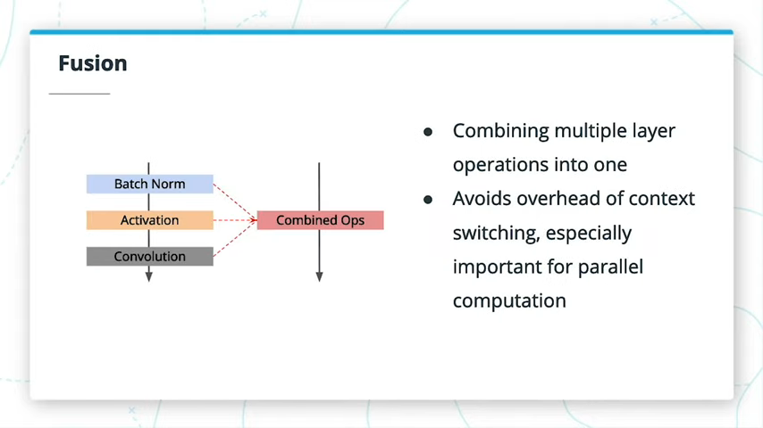
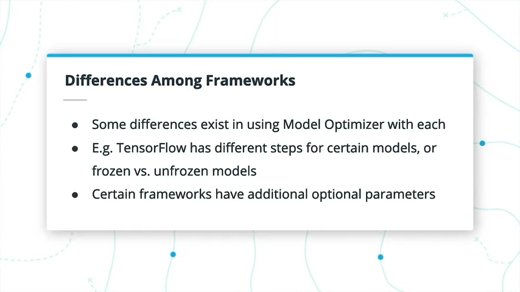
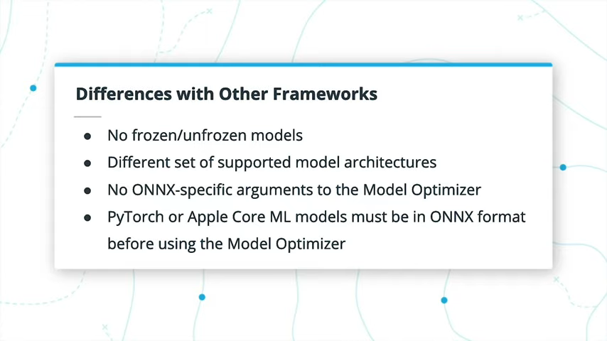

# 3 The Model Optimizer

## 3.1 Introduction

在本课中，我们将介绍：
- 模型优化器的基础
- 不同的优化技术及其对模型性能的影响
- 英特尔®OpenVINO™Toolkit发行版中支持的框架
- 从那些框架中的模型转换为中间表示
- 自定义层

## 3.2 The Model Optimizer


模型优化器有助于将多个不同框架中的模型转换为中间表示，该中间表示与推理引擎一起使用。如果模型不是OpenVINO™提供的预训练模型中的预转换模型之一，则是进入推理引擎的必要步骤。


作为该过程的一部分，它可以执行各种优化，这些优化可以帮助缩小模型大小并帮助使其更快，尽管这不会给模型带来更高的推断精度。实际上，由于诸如较低的精度之类的潜在变化，将导致一些精度损失。但是，这些精度损失是最小化的。

### 本地配置


鉴于您已经安装了OpenVINO™，因此对于本地计算机，配置Model Optimizer非常简单。 您可以首先导航到OpenVINO™安装目录，该目录通常是`/opt/intel/openvino`。然后，转到`/deployment_tools/model_optimizer/install_prerequisites`，并在其中运行`install_prerequisites.sh`脚本。

### 开发人员文档

您可以在[此处](https://docs.openvinotoolkit.org/2019_R3/_docs_MO_DG_Deep_Learning_Model_Optimizer_DevGuide.html)找到用于使用Model Optimizer的开发人员文档。在整个课程中，我们将对其进行更深入的研究。


模型优化器将模型转换为中间表示，以与推理引擎一起使用。该过程包括与模型大小和速度有关的潜在改进，并在准确性上进行了潜在的权衡。

## 3.3 Optimization Techniques

在这里，我主要关注三种优化技术：量化，冻结和融合。请注意，在视频结尾，当我提到硬件优化时，这些优化是由推理引擎（我们将在下一课中介绍）而不是模型优化器完成的。

### Quantization


量化与我之前提到的精度主题有关，或者与多少位用来表示模型的**权重和偏差**有关。在训练过程中，拥有这些非常准确的数字可能会有所帮助，但通常可以推断出，可以降低精度而又不会大幅降低精度。量化是降低模型精度的过程。

使用OpenVINO™Toolkit，模型通常默认为FP32或32位浮点值，而FP16和INT8则为16位浮点和8位整数值，也可用（**INT8仅在Pre-trained模型可得到；模型优化器当前不支持该级别的精度**）。FP16和INT8将失去一些准确性，但是该模型的内存较小，计算速度更快。因此，量化是在边缘运行模型的常用方法。

### Freezing


在这种情况下，Freezing用于TensorFlow模型。Freezing TensorFlow模型将删除仅训练所需的某些操作和元数据，例如与反向传播相关的那些操作和元数据。Freezing TensorFlow模型通常是一个好主意，无论是在执行直接推断之前还是在使用Model Optimizer进行转换之前。

### Fusion



融合涉及将多层操作组合为单个操作。例如，Batch Normalization层，activation层和卷积层可以组合为单个操作。这对于GPU推理特别有用，在GPU推理中，单独的操作可能发生在单独的GPU内核上，而融合操作发生在一个内核上，从而在从一个内核切换到下一个内核时产生较少的开销。


### 进一步的研究
- 如果您想了解有关量化的更多信息，请查看这篇有用的[文章](https://nervanasystems.github.io/distiller/quantization.html)。
- 您可以在OpenVINO™Toolkit中找到有关模型优化器执行的优化的[更多信息](https://docs.openvinotoolkit.org/2019_R3/_docs_MO_DG_prepare_model_Model_Optimization_Techniques.html)。

## 3.4 Supported Frameworks


这些都是开源的，就像OpenVINO™Toolkit一样。Caffe来自加州大学伯克利分校，TensorFlow来自Google Brain，MXNet来自Apache Software，ONNX是Facebook和Microsoft的共同努力，而Kaldi最初是个人的努力。其中大多数是相当多用途的框架，而Kaldi主要专注于语音识别数据。



尽管大多数差异是在OpenVINO™工具包的支持下进行的，但是如何精确地处理这些差异却不相同。例如，对于某些模型，TensorFlow或冻结模型与未冻结模型有一些不同的步骤。但是，大多数功能在所有受支持的框架之间共享。


## 3.5 Intermediate Representations


中间表示（IR）是OpenVINO™工具包的标准结构和神经网络体系结构的命名。TensorFlow中的Conv2D层，Caffe中的卷积层或ONNX中的Conv层都被转换为IR中的卷积层。


IR可以直接加载到推理引擎中，实际上是由Model Optimizer的两个输出文件组成的：XML文件和二进制文件。XML文件包含模型体系结构和其他重要的元数据，而二进制文件则以二进制格式保存权重和偏差。您需要同时使用这两个文件才能进行推断。在模型优化器生成模型时，会进行任何所需的优化，例如对精度的更改。您可以使用`--data_type`参数生成某些精度，默认情况下通常为`FP32`。


在这里，模型优化器的工作几乎就像翻译器一样，使中间表示成为所有受支持框架的共享方言，推理引擎可以理解。

### 进一步的研究
- 您可以在OpenVINO™Toolkit中找到有关转换模型的主要[开发人员文档](https://docs.openvinotoolkit.org/2019_R3/_docs_MO_DG_prepare_model_convert_model_Converting_Model.html)。在接下来的几页中，我们将介绍如何使用TensorFlow，Caffe和ONNX（适用于PyTorch）进行操作。
- 在转换为IR时，可以在不同的层名称上找到文档。[link](https://docs.openvinotoolkit.org/2019_R3/_docs_MO_DG_prepare_model_Supported_Frameworks_Layers.html)
- 最后，您可以在此处找到有关每个中间表示层本身的更深入的数据。[link](https://docs.openvinotoolkit.org/2019_R3/_docs_MO_DG_prepare_model_convert_model_IRLayersCatalogSpec.html)

## 3.6 Using the Model Optimizer with TensorFlow Models


配置好模型优化器后，下一步要做的就是确定TensorFlow模型是使用冻结模型还是未冻结模型。您可以冻结模型（我建议这样做），也可以使用文档中的单独说明转换非冻结模型。TensorFlow中的某些模型可能已经为您冻结，因此您可以跳过此步骤。

从那里，您可以将模型输入到模型优化器中，并获得中间表示。但是，该阶段可能有一些特定于TensorFlow的项目，您需要将其输入到Model Optimizer中，然后它才能创建用于推理引擎的IR。


TensorFlow模型可以因模型类型，未冻结或冻结或来自TensorFlow Detection Model Zoo，而需要采取的其他步骤有所不同。
- 未冻结的模型通常需要将`--mean_values`和`--scale`参数提供给模型优化器，而Object Detection Model Zoo中的冻结模型则不需要这些参数。
- 但是，冻结的模型将需要特定于TensorFlow的参数，例如`--tensorflow_use_custom_operations_config`和`--tensorflow_object_detection_api_pipeline_config`。 另外，通常需要`--reverse_input_channels`，因为TF模型Zoo模型是在RGB图像上训练的，而OpenCV通常是作为BGR加载的。 某些型号，例如YOLO，DeepSpeech等，都有各自单独的页面。

### TensorFlow Object Detection Model Zoo


TensorFlow对象检测模型库中的模型可用于进一步扩展您可用的预训练模型。它们采用TensorFlow格式，因此需要将其馈送到模型优化器以获取IR。这些模型仅专注于带有边界框的对象检测，但是有许多不同的模型架构可用。

### 进一步研究
- 可在[此处](https://docs.openvinotoolkit.org/2019_R3/_docs_MO_DG_prepare_model_convert_model_Convert_Model_From_TensorFlow.html)找到有关转换TensorFlow模型的开发人员文档。 在下一个练习中，您将完成此过程。
- TensorFlow在[TensorFlow Detection Model Zoo](https://github.com/tensorflow/models/blob/master/research/object_detection/g3doc/detection_model_zoo.md)中还提供了其他模型。通过将这些转换为中间表示，您可以进一步扩展可用的预训练模型。

## 3.7 Exercise: Convert a TF Model

- 参考
```
<INSTALL_DIR>/deployment_tools/model_optimizer/mo_tf.py --input_model=/tmp/ssd_inception_v2_coco_2018_01_28/frozen_inference_graph.pb --transformations_config <INSTALL_DIR>/deployment_tools/model_optimizer/extensions/front/tf/ssd_v2_support.json --tensorflow_object_detection_api_pipeline_config /tmp/ssd_inception_v2_coco_2018_01_28/pipeline.config --reverse_input_channels
```
- 作业
```bash
(venv) root@ae98e9d7efcf:/home/workspace/ssd_mobilenet_v2_coco_2018_03_29# history
    1  source /opt/intel/openvino/bin/setupvars.sh -pyver 3.5
    2  wget http://download.tensorflow.org/models/object_detection/ssd_mobilenet_v2_coco_2018_03_29.tar.gz
    3  tar xvzf ssd_mobilenet_v2_coco_2018_03_29.tar.gz 
    4  cd ssd_mobilenet_v2_coco_2018_03_29
    5  ls
    6  python /opt/intel/openvino/deployment_tools/model_optimizer/mo_tf.py --input_model=frozen_inference_graph.pb --tensorflow_use_custom_operations_config /opt/intel/openvino/deployment_tools/model_optimizer/extensions/front/tf/ssd_v2_support.json --tensorflow_object_detection_api_pipeline_config pipeline.config --reverse_input_channels
```

## 3.8 Solution: Convert a TF Model
```bash
python /opt/intel/openvino/deployment_tools/model_optimizer/mo.py --input_model frozen_inference_graph.pb --tensorflow_object_detection_api_pipeline_config pipeline.config --reverse_input_channels --tensorflow_use_custom_operations_config /opt/intel/openvino/deployment_tools/model_optimizer/extensions/front/tf/ssd_v2_support.json
```

## 3.9 Using the Model Optimizer with Caffe Models


Caffe模型的转换过程与TensorFlow十分相似，尽管这次没有涉及冻结模型，因为这是TensorFlow的概念。Caffe在支持的模型体系结构集合中确实存在一些差异。此外，Caffe模型需要将`.caffemodel`文件和`.prototxt`文件都输入到Model Optimizer中。如果它们具有相同的名称，则只需要直接输入模型作为参数，而如果`.prototxt`文件的名称与模型不同，则也应使用`--input_proto`来输入。


### 进一步的研究

有关转换Caffe模型的开发人员文档，请参见[此处](https://docs.openvinotoolkit.org/2019_R3/_docs_MO_DG_prepare_model_convert_model_Convert_Model_From_Caffe.html)。在下一个练习中，您将完成此过程。

## 3.10 Exercise: Convert a Caffe Model
```bash
3  git clone https://github.com/DeepScale/SqueezeNet
4  cd SqueezeNet/
6  cd SqueezeNet_v1.1/
7  python /opt/intel/openvino/deployment_tools/model_optimizer/mo.py --input_model squeezenet_v1.1.caffemodel --input_proto deploy.prototxt
```

## 3.11 Solution: Convert a Caffe Model
```bash
python /opt/intel/openvino/deployment_tools/model_optimizer/mo.py --input_model squeezenet_v1.1.caffemodel --input_proto deploy.prototxt
```

## 3.12 Using the Model Optimizer with ONNX Models


用于转换ONNX模型的过程再次与前两个过程非常相似，不过ONNX对模型优化器没有任何特定于ONNX的参数。因此，您只有更改精度等项目的常规参数。

此外，如果您使用的是PyTorch或Apple ML模型，则需要先将其转换为ONNX格式，这是在OpenVINO™工具包之外完成的。如果您有兴趣的话，请参阅本页下方的链接。



### Further Research
- 可以在[此处](https://docs.openvinotoolkit.org/2019_R3/_docs_MO_DG_prepare_model_convert_model_Convert_Model_From_ONNX.html)找到用于转换ONNX模型的开发者文档。 在下一个练习中，您将完成此过程。
- [ONNX Model Zoo](https://github.com/onnx/models)中还提供了其他模型。 通过将这些转换为中间表示，您可以进一步扩展可用的预训练模型。
### PyTorch to ONNX
如果您有兴趣使用ONNX转换PyTorch模型以与OpenVINO™Toolkit一起使用，请查看此[链接](https://michhar.github.io/convert-pytorch-onnx/)以获取相关步骤。 在这里，您可以按照ONNX模型的步骤进行操作，以获取中间表示。

## 3.13 Exercise: Convert an ONNX Model

```bash
1  source /opt/intel/openvino/bin/setupvars.sh -pyver 3.5
3  wget https://s3.amazonaws.com/download.onnx/models/opset_8/bvlc_alexnet.tar.gz
4  tar xvf bvlc_alexnet.tar.gz 
5  cd bvlc_alexnet
6  python /opt/intel/openvino/deployment_tools/model_optimizer/mo.py --input_model model.onnx

(venv) root@dc8e1012ff64:/home/workspace/bvlc_alexnet# python /opt/intel/openvino/deployment_tools/model_optimizer/mo.py --input_model model.onnx

Model Optimizer arguments:
Common parameters:
        - Path to the Input Model:      /home/workspace/bvlc_alexnet/model.onnx
        - Path for generated IR:        /home/workspace/bvlc_alexnet/.
        - IR output name:       model
        - Log level:    ERROR
        - Batch:        Not specified, inherited from the model
        - Input layers:         Not specified, inherited from the model
        - Output layers:        Not specified, inherited from the model
        - Input shapes:         Not specified, inherited from the model
        - Mean values:  Not specified
        - Scale values:         Not specified
        - Scale factor:         Not specified
        - Precision of IR:      FP32
        - Enable fusing:        True
        - Enable grouped convolutions fusing:   True
        - Move mean values to preprocess section:       False
        - Reverse input channels:       False
ONNX specific parameters:
Model Optimizer version:        2019.3.0-408-gac8584cb7

[ SUCCESS ] Generated IR model.
[ SUCCESS ] XML file: /home/workspace/bvlc_alexnet/./model.xml
[ SUCCESS ] BIN file: /home/workspace/bvlc_alexnet/./model.bin
[ SUCCESS ] Total execution time: 5.47 seconds. 
```

## 3.14 Solution: Convert an ONNX Model
```
python /opt/intel/openvino/deployment_tools/model_optimizer/mo.py --input_model model.onnx
```
## 3.15 Cutting Parts of a Model


切割模型主要适用于TensorFlow模型。正如我们之前在转换这些模型时所看到的，它们有时具有一些额外的复杂性。进行切割的一些常见原因是：
- 模型具有无法转化为现有Inference Engine层的预处理或后处理部分。
- 该模型具有训练部分，该训练部分便于保留在模型中，但在推理过程中不使用。
- 该模型过于复杂，包含许多不受支持的操作，因此无法一次转换完整的模型。
- 该模型是受支持的SSD模型之一。 在这种情况下，您需把后处理部分切割掉。
- 模型优化器中的模型转换或推理引擎中的推理可能存在问题。为了定位问题，剪切模型可以帮助发现问题 


有两个主要的命令行参数可用于通过Model Optimizer切割模型，它们的直观名称为`--input`和`--output`，用于输入作为模型新入口或出口点的层名称。

### Developer Documentation

这是开发人员的[文档](https://docs.openvinotoolkit.org/2019_R3/_docs_MO_DG_prepare_model_convert_model_Cutting_Model.html)，用于切割模型。

## 3.16 Supported Layers


先前，在查看从支持的框架转换为IR的名称时，我们看到了一些支持的层。虽然该列表对一次性使用很有用，但您可能不想检查模型中的每个图层是否受支持。您还可以只看到运行Model Optimizer时将转换的内容。


当模型优化器不支持图层时会发生什么？ 
- 一种可能的解决方案是使用自定义层，我们将在稍后介绍。 
- 另一个解决方案实际上是在其原始框架中运行给定的不受支持的层。例如，如果Model Optimizer不支持，则可能使用TensorFlow加载和处理在该框架中构建的特定图层的输入和输出。
- 最后，某些硬件还存在不受支持的层，使用推理引擎时可能会遇到这些层。在这种情况下，有时会有可用扩展来增加支持。 在下一课中，我们将详细讨论该方法。


Model Optimizer支持您可能在自己的神经网络中使用的几乎每个图层，但有时您需要使用“自定义图层”，我们将在后面介绍。

### Supported Layers List

https://docs.openvinotoolkit.org/2019_R3/_docs_MO_DG_prepare_model_Supported_Frameworks_Layers.html

## 3.17 Custom Layers


定制层对于拥有OpenVINO™工具包的功能是必不可少且重要的，尽管由于所有受支持的层，您都不必经常使用（如果有的话）。但是，了解它的存在以及在需要时如何使用它会很有用。

较早版本所支持的层的列表与给定层是否为自定义层非常直接相关。模型优化器会将不在该列表中的任何图层自动分类为自定义图层。


要实际添加自定义层，根据原始模型框架会有一些差异。 在TensorFlow和Caffe中，**第一个选择**是将自定义图层注册为Model Optimizer的扩展。

对于Caffe，第二**个选项**是将图层注册为“自定义”，然后**使用Caffe计算图层的输出形状**。您需要在系统上使用Caffe才能执行此选项。

对于TensorFlow，其**第二个选择**是将不支持的子图实际替换为其他子图。最终的TensorFlow选项是在推理期间将子图的计算实际分流回TensorFlow。

您将有机会在下一个练习中进行练习。同样，由于这是一个高级主题，我们在这里不会做太多深入的探讨，但是如果您想了解更多信息，请随时查看链接的文档。

### Further Research
接下来，您将有机会动手使用“自定义图层”，但请随时查看开[发人员文档](https://docs.openvinotoolkit.org/2019_R3/_docs_MO_DG_prepare_model_customize_model_optimizer_Customize_Model_Optimizer.html)。

如果您对使用TensorFlow在给定的不受支持的图层上进行操作的选项感兴趣，则还应确保阅读此处的[文档](https://docs.openvinotoolkit.org/2019_R3/_docs_MO_DG_prepare_model_customize_model_optimizer_Offloading_Sub_Graph_Inference.html)。

## 3.18

## 3.19 Recap


## 3.20 Lesson Glossary

### Model Optimizer
A command-line tool used for converting a model from one of the supported frameworks to an Intermediate Representation (IR), including certain performance optimizations, that is compatible with the Inference Engine.

一种用于将模型从支持的框架之一转换为中间表示（IR）的命令行工具，其中包括与推理引擎兼容的某些性能优化。

### Optimization Techniques
Optimization techniques adjust the original trained model in order to either reduce the size of or increase the speed of a model in performing inference. Techniques discussed in the lesson include quantization, freezing and fusion.

优化技术会调整原始训练后的模型，以减小模型的大小或提高模型执行推理的速度。本课中讨论的技术包括量化，冻结和融合。

### Quantization
Reduces precision of weights and biases (to lower precision floating point values or integers), thereby reducing compute time and size with some (often minimal) loss of accuracy.

降低权重和偏差的精度（以降低精度的浮点值或整数），从而减少计算时间和大小，同时损失一些（通常是最小的）精度。

### Freezing
In TensorFlow this removes metadata only needed for training, as well as converting variables to constants. Also a term in training neural networks, where it often refers to freezing layers themselves in order to fine tune only a subset of layers.

在TensorFlow中，这将删除仅用于训练以及将变量转换为常量所需的元数据。也是训练神经网络的一个术语，它通常指的是冻结层本身，以便仅微调层的子集。

### Fusion
The process of combining certain operations together into one operation and thereby needing less computational overhead. For example, a batch normalization layer, activation layer, and convolutional layer could be combined into a single operation. This can be particularly useful for GPU inference, where the separate operations may occur on separate GPU kernels, while a fused operation occurs on one kernel, thereby incurring less overhead in switching from one kernel to the next.

将某些操作组合为一个操作，从而需要较少的计算开销的过程。例如，BatchNormalization层，激活层和卷积层可以组合为单个操作。这对于GPU推理特别有用，在GPU推理中，单独的操作可能发生在单独的GPU内核上，而融合操作发生在一个内核上，从而在从一个内核切换到下一个内核时产生较少的开销。

### Supported Frameworks
The Intel® Distribution of OpenVINO™ Toolkit currently supports models from five frameworks (which themselves may support additional model frameworks): Caffe, TensorFlow, MXNet, ONNX, and Kaldi.

Intel® Distribution of OpenVINO™ Toolkit 目前支持来自五个框架的模型（它们本身可能支持其他模型框架）：Caffe，TensorFlow，MXNet，ONNX和Kaldi。

### Caffe
The “Convolutional Architecture for Fast Feature Embedding” (CAFFE) framework is an open-source deep learning library originally built at UC Berkeley.

“快速特征嵌入的卷积体系结构”（CAFFE）框架是最初在加州大学伯克利分校建立的开源深度学习库。

### TensorFlow
TensorFlow is an open-source deep learning library originally built at Google. As an Easter egg for anyone who has read this far into the glossary, this was also your instructor’s first deep learning framework they learned, back in 2016 (pre-V1!).

TensorFlow是最初在Google建立的开源深度学习库。作为对词汇表有如此深入了解的任何人的复活节彩蛋，这也是您的老师在2016年（V1之前的版本）学习的第一个深度学习框架。

### MXNet
Apache MXNet is an open-source deep learning library built by Apache Software Foundation.

Apache MXNet是由Apache Software Foundation构建的开源深度学习库。

### ONNX
The “Open Neural Network Exchange” (ONNX) framework is an open-source deep learning library originally built by Facebook and Microsoft. PyTorch and Apple-ML models are able to be converted to ONNX models.

“开放神经网络交换”（ONNX）框架是最初由Facebook和Microsoft构建的开源深度学习库。 PyTorch和Apple-ML模型可以转换为ONNX模型。

### Kaldi
While still open-source like the other supported frameworks, Kaldi is mostly focused around speech recognition data, with the others being more generalized frameworks.

尽管与其他受支持框架一样，仍是开源的，但Kaldi大多专注于语音识别数据，而其他则是更为通用的框架。

### Intermediate Representation
A set of files converted from one of the supported frameworks, or available as one of the Pre-Trained Models. This has been optimized for inference through the Inference Engine, and may be at one of several different precision levels. Made of two files:
- .xml - Describes the network topology
- .bin - Contains the weights and biases in a binary file

从一个受支持的框架转换而来的一组文件，或者可以作为一种预先训练的模型获得。这已针对通过推理引擎进行的推理进行了优化，并且可能处于几种不同的精度级别之一。由两个文件组成：
- .xml - 描述网络拓扑
- .bin - 在二进制文件中包含权重和偏差

### Supported Layers
Layers supported for direct conversion from supported framework layers to intermediate representation layers through the Model Optimizer. While nearly every layer you will ever use is in the supported frameworks is supported, there is sometimes a need for handling Custom Layers.

支持的层，用于通过模型优化器从支持的框架层直接转换为中间表示层。虽然几乎所有您将要使用的层都在受支持的框架中受支持，但有时仍需要处理自定义层。

### Custom Layers
Custom layers are those outside of the list of known, supported layers, and are typically a rare exception. Handling custom layers in a neural network for use with the Model Optimizer depends somewhat on the framework used; other than adding the custom layer as an extension, you otherwise have to follow instructions specific to the framework.

自定义层是已知受支持的层列表之外的那些层，通常是很少见的例外。在神经网络中处理与Model Optimizer一起使用的自定义层在某种程度上取决于所使用的框架。除了添加自定义层作为扩展之外，您还必须遵循特定于框架的说明。
