# 4 The Inference Engine

## 4.1 Introduction

在本课程中，我们将介绍：
- 推理引擎基础
- 支持的设备
- 将中间表示提供给推理引擎
- 进行推理请求
- 处理推理引擎的结果
- 将推理模型集成到App中

## 4.2 The Inference Engine

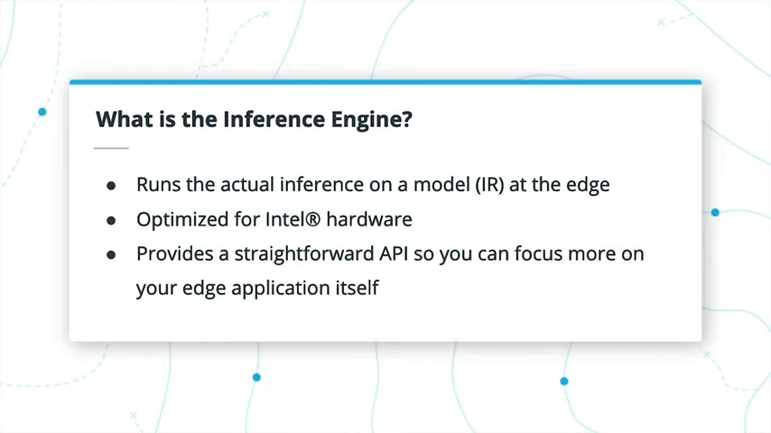

推理引擎在模型上运行实际推理。它仅适用于来自Model Optimizer的中间表示形式，或已采用IR格式的OpenVINO™中的英特尔®预训练模型。

在模型优化器对模型的大小和复杂性进行一些改进以改善内存和计算时间的地方，推理引擎提供了基于硬件的优化，可以从模型中获得进一步的改进。 这确实使您的应用程序能够在边缘运行，并尽可能少地使用设备资源。


推理引擎具有简单的API，可以轻松集成到您的边缘应用程序中。 推理引擎本身实际上是用C++构建的（至少对于CPU版本而言），从而使整体操作更快。但是，利用内置的Python包装器在Python代码中与其交互是非常普遍的。

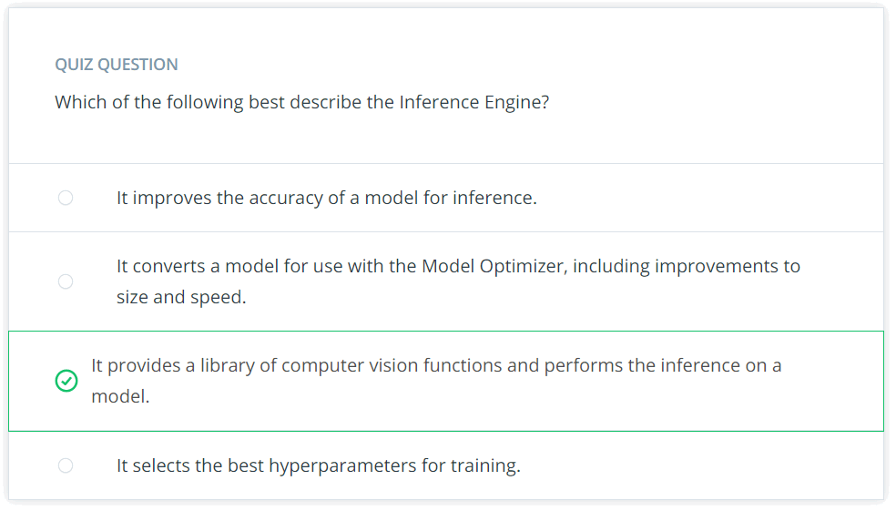

### Developer Documentation

[Inference Engine Developer Guide](https://docs.openvinotoolkit.org/2019_R3/_docs_IE_DG_Deep_Learning_Inference_Engine_DevGuide.html)

## 4.3 Supported Devices

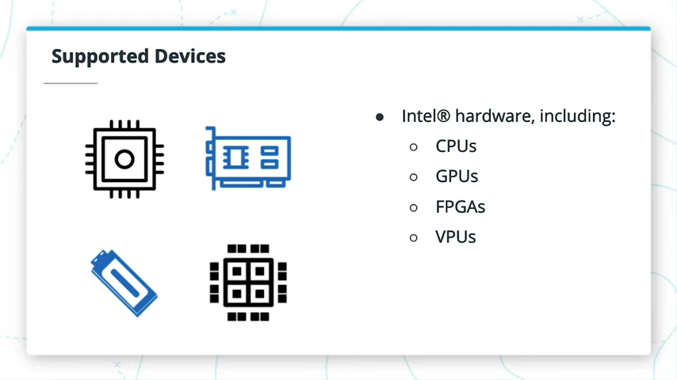

推理引擎支持的设备都是英特尔®硬件，并且包括以下各种设备：CPU，包括集成图形处理器，GPU，FPGA和VPU。 您可能知道已经有哪些CPU和GPU，但可能还不知道。

客户可以在制造后进一步配置FPGA或现场可编程门阵列。因此，名称的“现场可编程”部分。

VPU或视觉处理单元将类似于英特尔®神经计算棒。它们是小型但功能强大的设备，可以插入其他硬件，以达到加速计算机视觉任务的特定目的。

### Differences Among Hardware

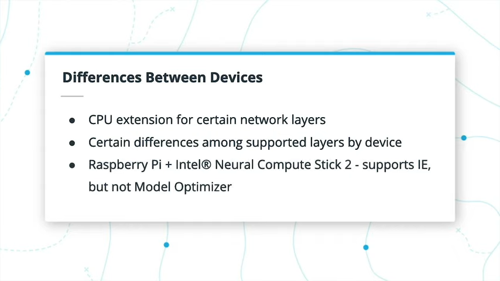

通常，推理引擎在一台设备上的运行方式将与其他受支持的设备相同。但是，您可能还记得我在上一课中提到CPU扩展。 唯一的区别是，当在CPU上使用推理引擎时，可以添加CPU扩展以支持其他层。

设备支持的各层之间也存在一些差异，这些差异链接到此页面底部。另一个要注意的重要事项是有关何时使用英特尔®神经计算棒（NCS）的信息。 在您自己的计算机外部本地测试边缘应用程序的一种简单，成本较低的方法是将[NCS2与Raspberry Pi](https://software.intel.com/en-us/articles/model-downloader-optimizer-for-openvino-on-raspberry-pi)一起使用。此组合**不直接支持Model Optimizer，因此您可能需要首先在另一个系统上创建一个中间表示**，尽管在设备上有一些方法的说明。 此组合仍支持推理引擎本身。


### Further Research

根据您的设备，不同的插件在功能和最佳配置方面确实存在一些差异。 您可以在此处阅读有关支持的设备的[更多信息](https://docs.openvinotoolkit.org/2019_R3/_docs_IE_DG_supported_plugins_Supported_Devices.html)。

## 4.4 Using the Inference Engine with an IR

### IECore and IENetwork

- [IECore documentation](https://docs.openvinotoolkit.org/2019_R3/classie__api_1_1IECore.html)

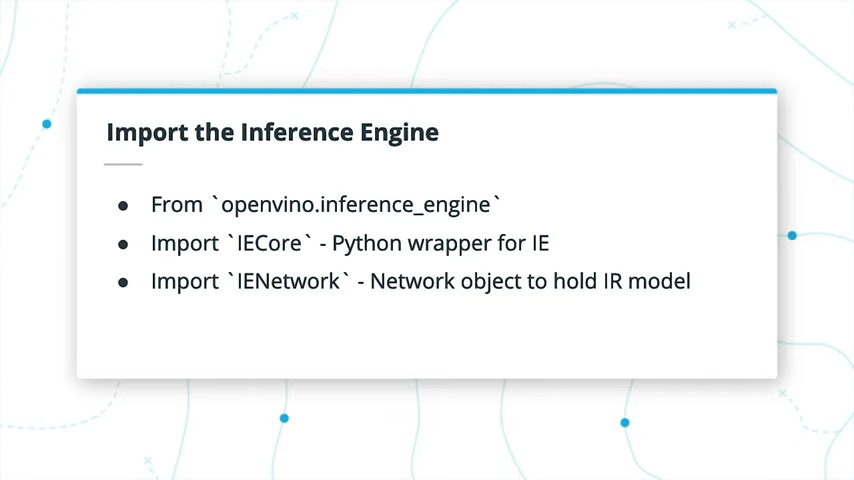

要将IR加载到推理引擎中，您将主要在`openvino.inference_engine`库中使用两个类（如果使用Python）:
- IECore，这是与推理引擎一起使用的Python包装器。 
- IENetwork，最初将保持网络并加载到IECore中

导入后的下一步是设置几个变量以实际使用IECore和IENetwork。在IECore文档中，不需要任何参数即可进行初始化。 要使用IENetwork，您需要加载名为model和weights的参数以进行初始化-组成模型的中间表示形式的XML和Binary文件。
### Check Supported Layers

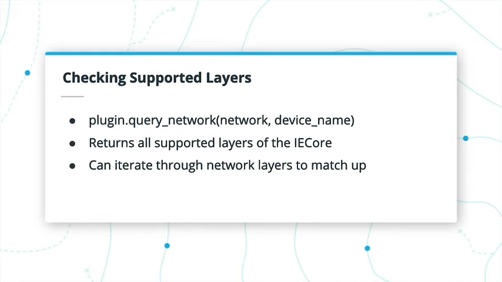

在IECore文档中，还有另一个名为`query_network`的函数，该函数以IENetwork和设备名称作为参数，并返回推理引擎支持的层列表。然后，您可以遍历创建的IENetwork中的图层，并检查它们是否在受支持的图层列表中。如果不支持层，则CPU扩展可能会提供帮助。
```python
def query_network (self, IENetwork, network, str, device_name, config=None)
```
device_name参数只是正在使用设备的字符串-“ CPU”，“ GPU”，“ FPGA”或“ MYRIAD”（适用于Neural Compute Stick）。

### CPU extension


如果使用Model Optimizer将图层成功构建到中间表示中，则在CPU上运行时，默认情况下，推理引擎仍可能不支持某些图层。但是，可能会使用可用的CPU扩展之一来支持它们。

尽管它们仍应位于相同的总体位置，但它们确实因操作系统而有所不同。如果导航到您的OpenVINO™安装目录，则请使用deployment_tools，inference_engine，lib，intel64：
- 在Linux上，您会看到一些可用于AVX和SSE的CPU扩展文件。这有点超出本课程的范围，但是如果您想了解更多内容，请查阅Advanced Vector Extensions。在classroom workspace中，SSE文件将正常工作。
  - 英特尔®凌动处理器使用SSE4，而英特尔®酷睿处理器将使用AVX。
  - 在将程序从基于Core的笔记本电脑传输到基于Atom的边缘设备时，要特别注意这一点尤其重要。如果在应用程序中指定了错误的扩展名，该程序将崩溃。
  - AVX系统可以运行SSE4库，但反之则不能。
- 在Mac上，只有一个CPU扩展名文件。

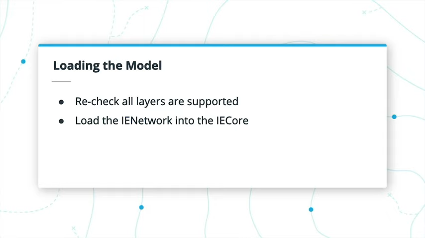

您可以使用它们的完整路径将它们直接添加到IECore中。添加CPU扩展后，如有必要，应重新检查是否支持所有图层。 如果是这样，那么现在是时候将模型加载到IECore中了。

### Further Research

随着您在下一个练习以及以后更多地使用推理引擎，下面是我发现对使用推理引擎有用的几页文档。
- [IE Python API](https://docs.openvinotoolkit.org/2019_R3/ie_python_api.html)
- [IE Network](https://docs.openvinotoolkit.org/2019_R3/classie__api_1_1IENetwork.html)
- [IE Core](https://docs.openvinotoolkit.org/2019_R3/classie__api_1_1IECore.html)

## 4.5 Exercise: Feed an IR to the Inference Engine

```python
import argparse
### TODO: Load the necessary libraries
from openvino.inference_engine import IECore, IENetwork
from pathlib import Path

CPU_EXTENSION = "/opt/intel/openvino/deployment_tools/inference_engine/lib/intel64/libcpu_extension_sse4.so"

def get_args():
    '''
    Gets the arguments from the command line.
    '''
    parser = argparse.ArgumentParser("Load an IR into the Inference Engine")
    # -- Create the descriptions for the commands
    m_desc = "The location of the model XML file"

    # -- Create the arguments
    parser.add_argument("-m", help=m_desc)
    args = parser.parse_args()

    return args


def load_to_IE(model_xml):
    ### TODO: Load the Inference Engine API
    ie = IECore()
    ### TODO: Load IR files into their related class
    path_to_xml_file = model_xml
    path_to_bin_file = str(Path(model_xml).with_suffix('.bin'))
    #print(path_to_xml_file, path_to_bin_file)
    net = IENetwork(model=path_to_xml_file, weights=path_to_bin_file)
    
    ### TODO: Add a CPU extension, if applicable. It's suggested to check
    ###       your code for unsupported layers for practice before 
    ###       implementing this. Not all of the models may need it.
    ie.add_extension(extension_path=CPU_EXTENSION, device_name="CPU")
    
    ### TODO: Get the supported layers of the network
    supported_layers = ie.query_network(network=net, device_name="CPU")
    
    ### TODO: Check for any unsupported layers, and let the user
    ###       know if anything is missing. Exit the program, if so.
    unsupported_layers = []
    for key in net.layers.keys():
        if key not in supported_layers.keys():
            unsupported_layers.append(key)
    if (len(unsupported_layers) != 0):
        for layer in unsupported_layers:
            print(layer)
        exit(1)

    ### TODO: Load the network into the Inference Engine
    exec_net = ie.load_network(network=net, device_name="CPU")
    
    print("IR successfully loaded into Inference Engine.")

    return

def main():
    args = get_args()
    load_to_IE(args.m)

if __name__ == "__main__":
    main()
```
## 4.6 Solution: Feed an IR to the Inference Engine

```python
### Load the necessary libraries
import os
from openvino.inference_engine import IENetwork, IECore
```
```python
def load_to_IE(model_xml):
    ### Load the Inference Engine API
    plugin = IECore()

    ### Load IR files into their related class
    model_bin = os.path.splitext(model_xml)[0] + ".bin"
    net = IENetwork(model=model_xml, weights=model_bin)

    ### Add a CPU extension, if applicable.
    plugin.add_extension(CPU_EXTENSION, "CPU")

    ### Get the supported layers of the network
    supported_layers = plugin.query_network(network=net, device_name="CPU")

    ### Check for any unsupported layers, and let the user
    ### know if anything is missing. Exit the program, if so.
    unsupported_layers = [l for l in net.layers.keys() if l not in supported_layers]
    if len(unsupported_layers) != 0:
        print("Unsupported layers found: {}".format(unsupported_layers))
        print("Check whether extensions are available to add to IECore.")
        exit(1)

    ### Load the network into the Inference Engine
    plugin.load_network(net, "CPU")

    print("IR successfully loaded into Inference Engine.")

    return
```
### Running Your Implementation
```
python feed_network.py -m /home/workspace/models/human-pose-estimation-0001.xml
```

## 4.7 Sending Inference Requests to the IE


将IENetwork加载到IECore中后，您将获得一个ExecutableNetwork，这是您将推理请求发送到的对象。您可以提出两种类型的推理请求：同步和异步。两者之间有一个重要的区别，即您的应用程序是坐着等待推理还是可以继续执行其他任务。

使用ExecutableNetwork，同步请求仅使用`infer`函数，而异步请求以`start_async`开头，然后您可以`wait`直到请求完成。这些请求是`InferRequest`对象，将保存请求的输入和输出。

我们将在下一页更深入地了解同步和异步之间的区别。

### Further Research

- [Executable Network documentation](https://docs.openvinotoolkit.org/2019_R3/classie__api_1_1ExecutableNetwork.html)
- [Infer Request documentation](https://docs.openvinotoolkit.org/2019_R3/classie__api_1_1InferRequest.html)

## 4.8 Asynchronous Requests

### Synchronous

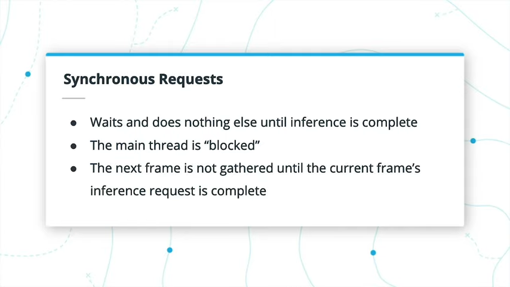

同步请求将等待，直到返回推理响应为止，不执行任何其他操作，从而阻塞了主线程。在这种情况下，一次只处理一帧，直到当前帧的推理请求完成后才能收集下一帧。

### Asynchronous

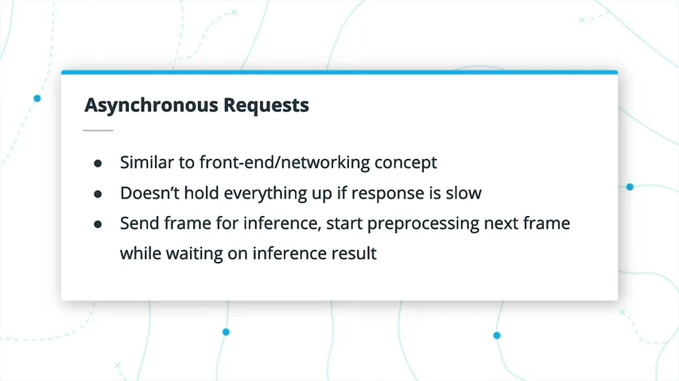

如果您从事前端或网络工作，则可能听说过异步。在这种情况下，您希望异步处理事物，因此，如果对特定项目的响应花费很长时间，则不会阻止网站或应用程序的其余部分正常加载或运行。

在我们的情况下，异步意味着在等待IE响应时其他任务可能会继续。当您希望其他事情仍然发生时，这很有用，这样，如果响应挂起了一点，应用程序就不会被请求完全冻结。

在同步中主线程被阻塞的地方，异步不会阻塞主线程。因此，您可以发送一帧进行推断，同时仍在收集和预处理下一帧。您可以使用“等待”过程来等待推断结果可用。

您也可以将其与多个网络摄像头一起使用，以便该应用可以从一个网络摄像头“抓取”新帧，而对另一个网络摄像头进行推理。

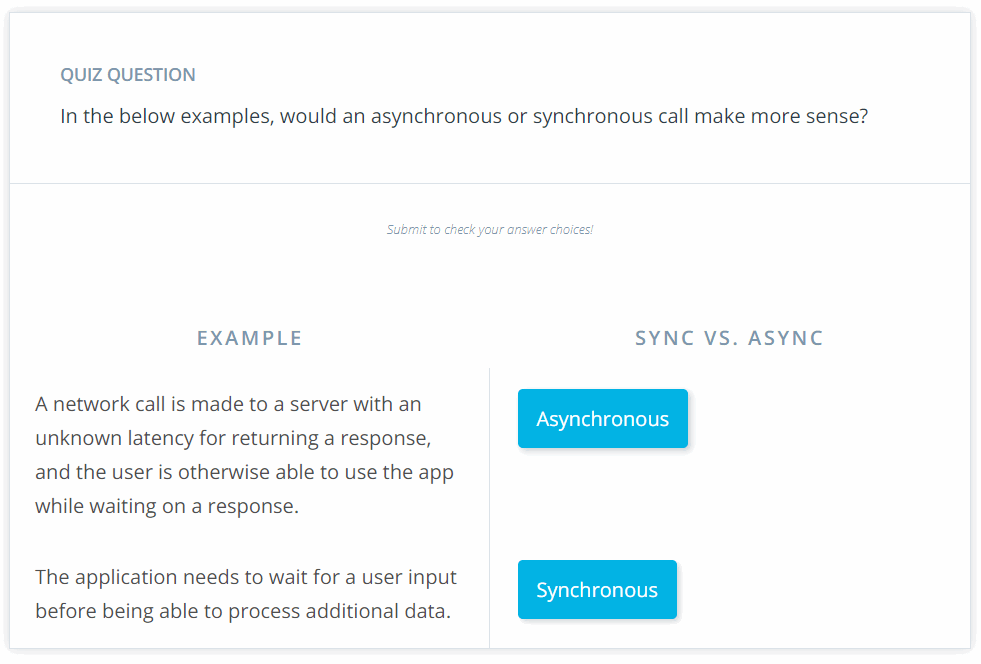

### Further Research
- 有关同步与异步的更多信息，请查看此有用的[文章](https://whatis.techtarget.com/definition/synchronous-asynchronous-API)。
- 您还可以查看有关将推理引擎集成到应用程序中的[文档](https://docs.openvinotoolkit.org/2019_R3/_docs_IE_DG_Integrate_with_customer_application_new_API.html)，以查看来自用于同步（Infer）与异步（StartAsync）的推理请求的不同函数调用。
- 最后，为了进一步实践异步推理请求，您可以查看此有用的[演示](https://github.com/opencv/open_model_zoo/blob/master/demos/object_detection_demo_ssd_async/README.md)。在接下来的练习中，您将有机会练习同步请求和异步请求。

## 4.9 Exercise: Inference Requests
- https://docs.openvinotoolkit.org/2019_R3/classie__api_1_1ExecutableNetwork.html#a314107a6b50f0ebf65751569973c760a
  
```python
import argparse
import cv2
from helpers import load_to_IE, preprocessing

CPU_EXTENSION = "/opt/intel/openvino/deployment_tools/inference_engine/lib/intel64/libcpu_extension_sse4.so"

def get_args():
    '''
    Gets the arguments from the command line.
    '''
    parser = argparse.ArgumentParser("Load an IR into the Inference Engine")
    # -- Create the descriptions for the commands
    m_desc = "The location of the model XML file"
    i_desc = "The location of the image input"
    r_desc = "The type of inference request: Async ('A') or Sync ('S')"

    # -- Create the arguments
    parser.add_argument("-m", help=m_desc)
    parser.add_argument("-i", help=i_desc)
    parser.add_argument("-r", help=i_desc)
    args = parser.parse_args()

    return args


def async_inference(exec_net, input_blob, image):
    ### TODO: Add code to perform asynchronous inference
    ### Note: Return the exec_net
    infer_request_handle = exec_net.start_async(request_id=0, inputs={input_blob: image})
    while True:
        infer_status = infer_request_handle.wait(-1)
        if infer_status == 0:
            break
    # res = infer_request_handle.outputs[out_blob_name]
    return exec_net


def sync_inference(exec_net, input_blob, image):
    ### TODO: Add code to perform synchronous inference
    ### Note: Return the result of inference
    res = exec_net.infer({input_blob: image})
    return res


def perform_inference(exec_net, request_type, input_image, input_shape):
    '''
    Performs inference on an input image, given an ExecutableNetwork
    '''
    # Get input image
    image = cv2.imread(input_image)
    # Extract the input shape
    n, c, h, w = input_shape
    # Preprocess it (applies for the IRs from the Pre-Trained Models lesson)
    preprocessed_image = preprocessing(image, h, w)

    # Get the input blob for the inference request
    input_blob = next(iter(exec_net.inputs))

    # Perform either synchronous or asynchronous inference
    request_type = request_type.lower()
    if request_type == 'a':
        output = async_inference(exec_net, input_blob, preprocessed_image)
    elif request_type == 's':
        output = sync_inference(exec_net, input_blob, preprocessed_image)
    else:
        print("Unknown inference request type, should be 'A' or 'S'.")
        exit(1)

    # Return the exec_net for testing purposes
    return output


def main():
    args = get_args()
    exec_net, input_shape = load_to_IE(args.m, CPU_EXTENSION)
    perform_inference(exec_net, args.r, args.i, input_shape)


if __name__ == "__main__":
    main()
```

## 4.10 Solution: Inference Requests

### Synchronous Solution
```python
def sync_inference(exec_net, input_blob, image):
    '''
    Performs synchronous inference
    Return the result of inference
    '''
    result = exec_net.infer({input_blob: image})

    return result
```
### Asynchronous Solution
```python
def async_inference(exec_net, input_blob, image):
    '''
    Performs asynchronous inference
    Returns the `exec_net`
    '''
    exec_net.start_async(request_id=0, inputs={input_blob: image})
    while True:
        status = exec_net.requests[0].wait(-1)
        if status == 0:
            break
        else:
            time.sleep(1)
    return exec_net
```
我实际上实际上不需要time.sleep() —— 将-1与wait()一起使用可以执行类似的功能。
### Testing
```
python test.py
```
## 4.11 Handling Results

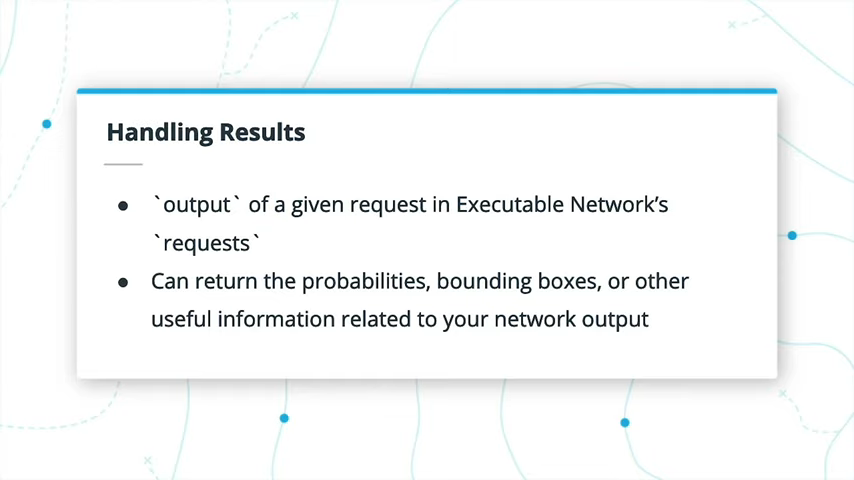

在上一个练习的结尾，您看到推理请求存储在`ExecutableNetwork`的`requests`属性中。在那里，我们关注`InferRequest`对象具有用于异步请求的`wait`函数的事实。

[ie_api.ExecutableNetwork Class Reference](https://docs.openvinotoolkit.org/2019_R3/classie__api_1_1ExecutableNetwork.html#a314107a6b50f0ebf65751569973c760a)

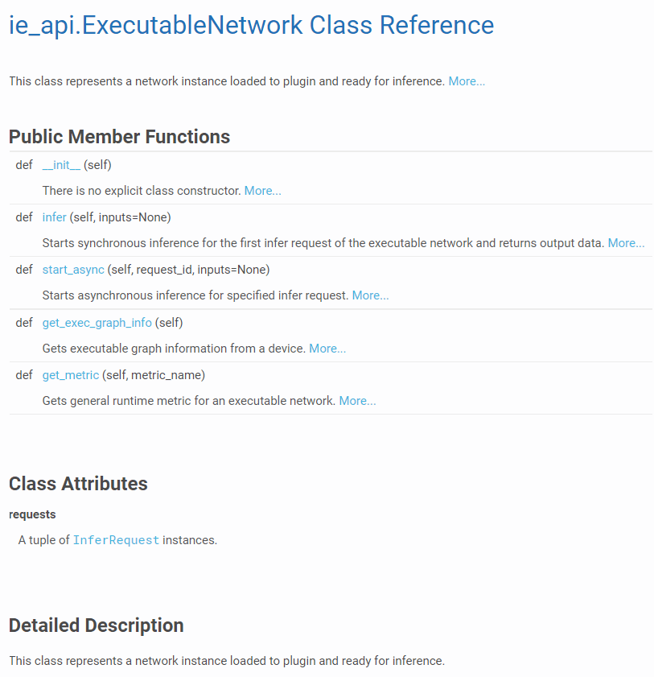

每个`InferRequest`还具有一些属性-即`inputs`，`outputs`和`latency`。顾名思义，在我们的例子中，`inputs`将是一个图像帧，`outputs`将包含结果，而`latency`记录了当前请求的推断时间，尽管我们现在不必担心。

[ie_api.InferRequest Class Reference](https://docs.openvinotoolkit.org/2019_R3/classie__api_1_1InferRequest.html#a12ca583f7617c5db9b8a4e8ab43f6979)

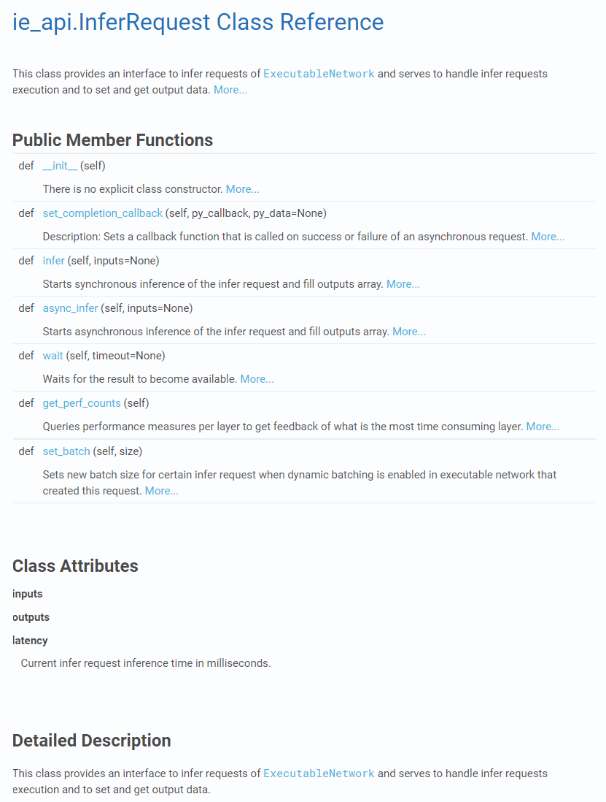

在请求完成后，准​​确打印`outputs`属性包含的内容可能对您很有用。现在，您可以在“prob”键或有时通过`output_blob`（请参阅相关文档）下要求它提供`data`，以获取从推理请求返回的概率数组。

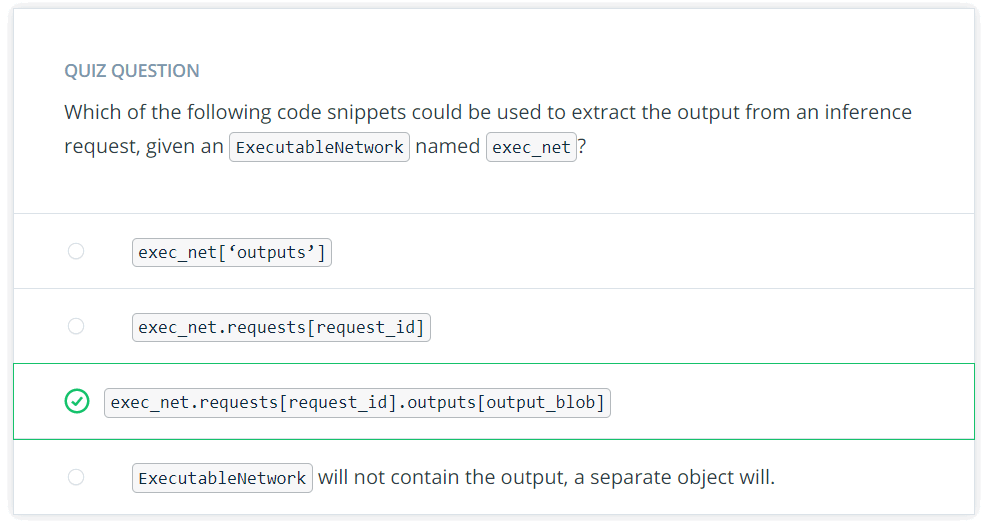

一个`ExecutableNetwork`包含一个带有`requests`名称的`InferRequest`属性，向该属性提供给定的request ID key将获得所讨论的特定推理请求。

在此`InferRequest`对象中，它具有`outputs`的属性，您可以从中使用`output_blob`获取该推断请求的结果。

## 4.12 Integrating into Your App

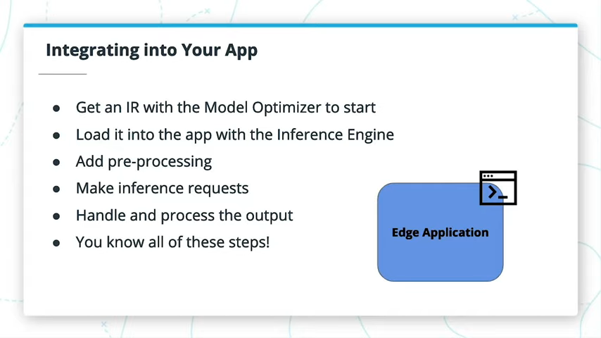

在即将进行的练习中，您将综合所有技能，并为您的应用添加更多自定义设置。

### Further Research

有大量潜在的边缘应用可供您构建。以下是一些希望使您思考的示例：
- [Intel®’s IoT Apps Across Industries](https://www.intel.com/content/www/us/en/internet-of-things/industry-solutions.html)
- [Starting Your First IoT Project](https://hackernoon.com/the-ultimate-guide-to-starting-your-first-iot-project-8b0644fbbe6d)
- [OpenVINO™ on a Raspberry Pi and Intel® Neural Compute Stick](https://www.pyimagesearch.com/2019/04/08/openvino-opencv-and-movidius-ncs-on-the-raspberry-pi/)

## 4.13 Exercise: Integrate into an App
- SSD to IR
```bash
(venv) root@ae98e9d7efcf:/home/workspace/ssd_mobilenet_v2_coco_2018_03_29# history
    1  source /opt/intel/openvino/bin/setupvars.sh -pyver 3.5
    2  wget http://download.tensorflow.org/models/object_detection/ssd_mobilenet_v2_coco_2018_03_29.tar.gz
    3  tar xvzf ssd_mobilenet_v2_coco_2018_03_29.tar.gz 
    4  cd ssd_mobilenet_v2_coco_2018_03_29
    5  ls
    6  python /opt/intel/openvino/deployment_tools/model_optimizer/mo_tf.py --input_model=frozen_inference_graph.pb --tensorflow_use_custom_operations_config /opt/intel/openvino/deployment_tools/model_optimizer/extensions/front/tf/ssd_v2_support.json --tensorflow_object_detection_api_pipeline_config pipeline.config --reverse_input_channels
```
- app.py
```python
import argparse
import cv2
from inference import Network

INPUT_STREAM = "test_video.mp4"
CPU_EXTENSION = "/opt/intel/openvino/deployment_tools/inference_engine/lib/intel64/libcpu_extension_sse4.so"

def get_args():
    '''
    Gets the arguments from the command line.
    '''
    parser = argparse.ArgumentParser("Run inference on an input video")
    # -- Create the descriptions for the commands
    m_desc = "The location of the model XML file"
    i_desc = "The location of the input file"
    d_desc = "The device name, if not 'CPU'"
    c_desc = "The color of the bounding boxes to draw; RED, GREEN or BLUE"
    ct_desc = "The confidence threshold to use with the bounding boxes"
    ### TODO: Add additional arguments and descriptions for:
    ###       1) Different confidence thresholds used to draw bounding boxes
    ###       2) The user choosing the color of the bounding boxes
    # -- Add required and optional groups
    parser._action_groups.pop()
    required = parser.add_argument_group('required arguments')
    optional = parser.add_argument_group('optional arguments')

    # -- Create the arguments
    required.add_argument("-m", help=m_desc, required=True)
    optional.add_argument("-i", help=i_desc, default=INPUT_STREAM)
    optional.add_argument("-d", help=d_desc, default='CPU')
    optional.add_argument("-c", help=c_desc, default='BLUE')
    optional.add_argument("-ct", help=ct_desc, default=0.5)
    args = parser.parse_args()
    args.c = convert_color(args.c)
    args.ct = float(args.ct)
    return args


def infer_on_video(args):
    ### TODO: Initialize the Inference Engine
    plugin = Network()
    ### TODO: Load the network model into the IE
    plugin.load_model(args.m, args.d, CPU_EXTENSION)
    net_input_shape = plugin.get_input_shape()
    # Get and open video capture
    cap = cv2.VideoCapture(args.i)
    cap.open(args.i)

    # Grab the shape of the input 
    width = int(cap.get(3))
    height = int(cap.get(4))

    # Create a video writer for the output video
    # The second argument should be `cv2.VideoWriter_fourcc('M','J','P','G')`
    # on Mac, and `0x00000021` on Linux
    out = cv2.VideoWriter('out.mp4', 0x00000021, 30, (width,height))
    
    # Process frames until the video ends, or process is exited
    while cap.isOpened():
        # Read the next frame
        flag, frame = cap.read()
        if not flag:
            break
        key_pressed = cv2.waitKey(60)

        ### TODO: Pre-process the frame
        p_frame = cv2.resize(frame, (net_input_shape[3], net_input_shape[2]))
        p_frame = p_frame.transpose((2,0,1))
        p_frame = p_frame.reshape(1, *p_frame.shape)
        ### TODO: Perform inference on the frame
        plugin.async_inference(p_frame)
        ### TODO: Get the output of inference
        if plugin.wait() == 0:
            result = plugin.extract_output()
        ### TODO: Update the frame to include detected bounding boxes
            frame = draw_boxes(frame, result, args, width, height)
        # Write out the frame
            out.write(frame)
        # Break if escape key pressed
        if key_pressed == 27:
            break

    # Release the out writer, capture, and destroy any OpenCV windows
    out.release()
    cap.release()
    cv2.destroyAllWindows()

def draw_boxes(frame, result, args, width, height):
    '''
    Draw bounding boxes onto the frame.
    '''
    for box in result[0][0]: # Output shape is 1x1x100x7
        conf = box[2]
        if conf >= args.ct:
            xmin = int(box[3] * width)
            ymin = int(box[4] * height)
            xmax = int(box[5] * width)
            ymax = int(box[6] * height)
            cv2.rectangle(frame, (xmin, ymin), (xmax, ymax), args.c, 1)
    return frame

def convert_color(color_string):
    '''
    Get the BGR value of the desired bounding box color.
    Defaults to Blue if an invalid color is given.
    '''
    colors = {"BLUE": (255,0,0), "GREEN": (0,255,0), "RED": (0,0,255)}
    out_color = colors.get(color_string)
    if out_color:
        return out_color
    else:
        return colors['BLUE']
    
def main():
    args = get_args()
    infer_on_video(args)


if __name__ == "__main__":
    main()
```
- inference.py
```python
'''
Contains code for working with the Inference Engine.
You'll learn how to implement this code and more in
the related lesson on the topic.
'''

import os
import sys
import logging as log
from openvino.inference_engine import IENetwork, IECore

class Network:
    '''
    Load and store information for working with the Inference Engine,
    and any loaded models.
    '''

    def __init__(self):
        self.plugin = None
        self.network = None
        self.input_blob = None
        self.output_blob = None
        self.exec_network = None
        self.infer_request = None


    def load_model(self, model, device="CPU", cpu_extension=None):
        '''
        Load the model given IR files.
        Defaults to CPU as device for use in the workspace.
        Synchronous requests made within.
        '''
        model_xml = model
        model_bin = os.path.splitext(model_xml)[0] + ".bin"

        # Initialize the plugin
        self.plugin = IECore()

        # Add a CPU extension, if applicable
        if cpu_extension and "CPU" in device:
            self.plugin.add_extension(cpu_extension, device)

        # Read the IR as a IENetwork
        self.network = IENetwork(model=model_xml, weights=model_bin)

        # Load the IENetwork into the plugin
        self.exec_network = self.plugin.load_network(self.network, device)

        # Get the input layer
        self.input_blob = next(iter(self.network.inputs))
        self.output_blob = next(iter(self.network.outputs))

        return


    def get_input_shape(self):
        '''
        Gets the input shape of the network
        '''
        return self.network.inputs[self.input_blob].shape


    def async_inference(self, image):
        '''
        Makes an asynchronous inference request, given an input image.
        '''
        ### TODO: Start asynchronous inference
        self.exec_network.start_async(request_id=0, 
            inputs={self.input_blob: image})
        return


    def wait(self):
        '''
        Checks the status of the inference request.
        '''
        ### TODO: Wait for the async request to be complete
        status = self.exec_network.requests[0].wait(-1)
        return status


    def extract_output(self):
        '''
        Returns a list of the results for the output layer of the network.
        '''
        ### TODO: Return the outputs of the network from the output_blob
        return self.exec_network.requests[0].outputs[self.output_blob]
```
- Run
```
python app.py -m ./ssd_mobilenet_v2_coco_2018_03_29/frozen_inference_graph.xml -ct 0.6 -c BLUE
```
## 4.14 Solution: Integrate into an App


## 4.15 Behind the Scenes of Inference Engine

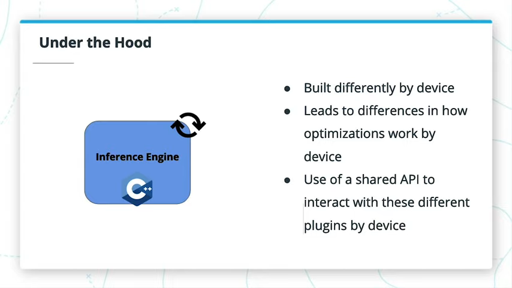

我很早就注意到，推理引擎是用C++构建和优化的，尽管那只是CPU版本。不同设备在引擎盖下实际发生的事情有所不同。您可以使用共享的API与推理引擎进行交互，同时很大程度上可以忽略这些差异。

### Why C++?
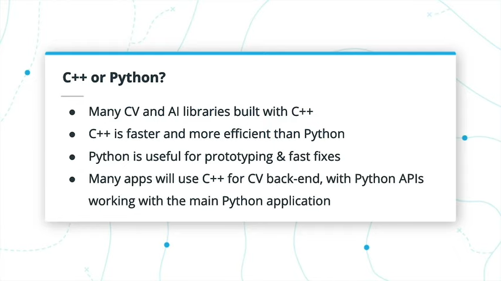

为什么推理引擎至少在CPU中内置C++？实际上，许多不同的Computer Vision和AI框架都是使用C++构建的，并具有其他Python接口。例如，OpenCV和TensorFlow主要是用C++构建的，但是许多用户与Python中的库进行交互。如果实现得当，C++比Python更快，更高效，它还使用户可以更直接地访问内存等内容，并且可以在模块之间更高效地传递它们。

C++是在运行时之前进行编译和优化的，而Python基本上是在运行脚本时逐行读取的。另一方面，Python可以使原型制作和快速修复变得更加容易。然后，通常将C++库用于实际的计算机视觉技术和推理，但将应用程序本身用Python编写，然后通过Python API与C++库进行交互。

### Optimizations by Device
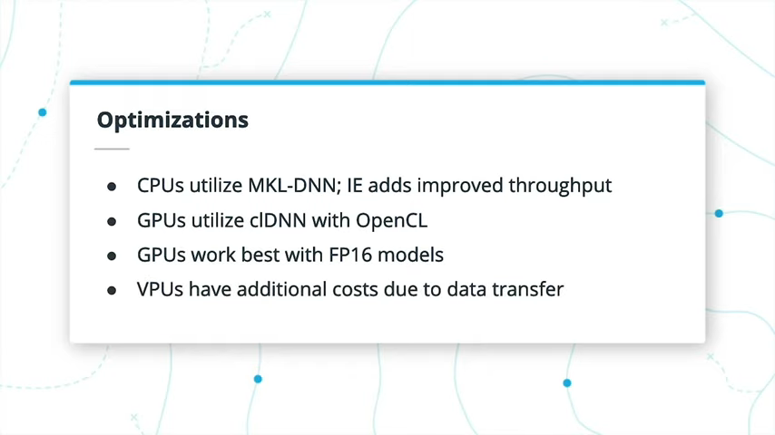

确切的优化因推理引擎的设备而异。 尽管从头到尾与Inference Engine的交互几乎是相同的，但实际上其中有单独的插件可用于每种设备类型。

例如，CPU依赖于用于深度神经网络或MKL-DNN的英特尔®数学内核库。CPU还需要做一些额外的工作来帮助提高设备的吞吐量，特别是对于具有更多内核数量的CPU。

GPU利用用于深度神经网络的计算库或clDNN，该库在内部使用OpenCL。加载GPU插件时，使用OpenCL会带来很小的开销，但这只是一次性开销。与FP32相比，GPU插件在FP16上最有效。

进入VPU设备（如英特尔®神经计算棒），与USB设备相关的其他成本较高。实际上，建议您在任何给定时间处理四个推理请求，以隐藏从主设备到VPU的数据传输成本。

### Further Research

关于机器学习和深度学习的最佳编程语言仍在争论中，但是这是一篇很棒的[博客文章](https://towardsdatascience.com/what-is-the-best-programming-language-for-machine-learning-a745c156d6b7)，旨在为您提供有关该主题的更多背景知识。

您可以查看《[优化指南](https://docs.openvinotoolkit.org/2019_R3/_docs_optimization_guide_dldt_optimization_guide.html)》，详细了解设备之间的优化差异。

## 4.16 Recap

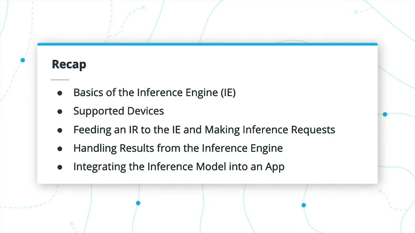

## 4.17 Lesson Glossary

### Inference Engine
Provides a library of computer vision functions, supports calls to other computer vision libraries such as OpenCV, and performs optimized inference on Intermediate Representation models. Works with various plugins specific to different hardware to support even further optimizations.

提供计算机视觉功能的库，支持对其他计算机视觉库（例如OpenCV）的调用，并在中间表示模型上执行优化的推断。 与特定于不同硬件的各种插件一起使用，以支持进一步的优化。

### Synchronous
Such requests wait for a given request to be fulfilled prior to continuing on to the next request.

在继续下一个请求之前，此类请求会等待给定的请求得到满足。
 
### Asynchronous
Such requests can happen simultaneously, so that the start of the next request does not need to wait on the completion of the previous.

这样的请求可以同时发生，因此下一个请求的开始不需要等待前一个请求的完成。

### IECore
The main Python wrapper for working with the Inference Engine. Also used to load an IENetwork, check the supported layers of a given network, as well as add any necessary CPU extensions.

用于推理引擎的主要Python包装器。 也用于加载`IENetwork`，检查给定网络的支持层，以及添加任何必要的CPU扩展。

### IENetwork
A class to hold a model loaded from an Intermediate Representation (IR). This can then be loaded into an IECore and returned as an Executable Network.

一个类，用于保存从中间表示（IR）加载的模型。然后可以将其加载到`IECore`中并作为`Executable Network`返回。

### ExecutableNetwork
An instance of a network loaded into an IECore and ready for inference. It is capable of both synchronous and asynchronous requests, and holds a tuple of InferRequest objects.

加载到`IECore`中并准备进行推理的网络实例。它既可以同步请求也可以异步请求，并具有一个`InferRequest`对象元组。

### InferRequest
Individual inference requests, such as image by image, to the Inference Engine. Each of these contain their inputs as well as the outputs of the inference request once complete.

对推理引擎的各个推理请求，例如逐个图像。一旦完成，它们中的每一个都包含其输入以及推理请求的输出。