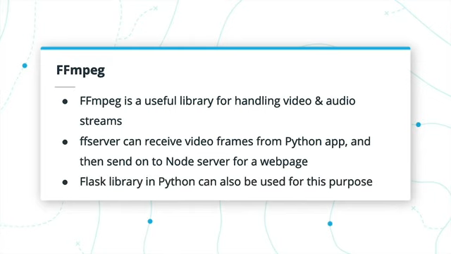
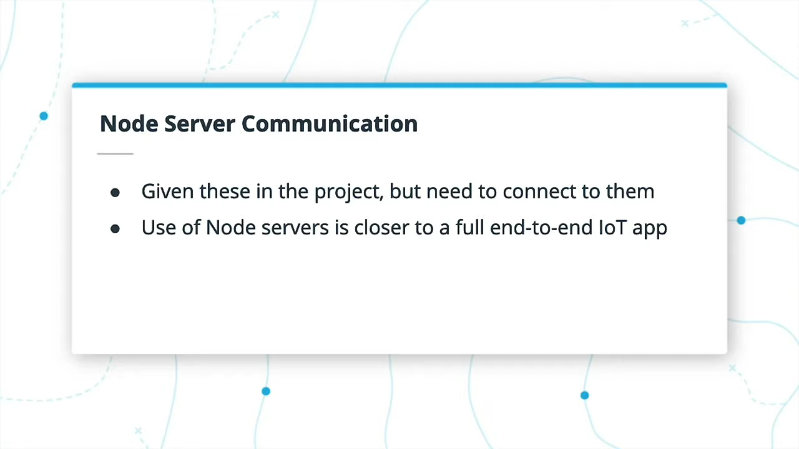

# 5 Deploying an Edge App

## 5.1 Introduction

在本课程中，我们将介绍：
- OpenCV基础
- 在OpenCV中处理输入流
- 处理模型输出以获取其他有用信息
- MQTT的基础知识及其与物联网设备的使用
- 向服务器发送统计数据和视频流
- 性能基本知识
- 最后，考虑额外的模型用例以及最终用户的需求

## 5.2 OpenCV Basics


OpenCV是一个用于各种图像处理和计算机视觉技术的开源库，它可以在高度优化的C++后端上运行，尽管它也可以与Python和Java一起使用。无论是使用内置的计算机视觉技术还是处理图像处理，它作为整体边缘应用程序的一部分通常都非常有用。


### Uses of OpenCV


OpenCV有很多用途。就您而言，您将主要关注它从视频流中捕获和读取帧的能力，以及其他预处理技术，例如将图像调整为模型的预期输入大小。它还具有其他预处理技术，例如从一种颜色空间转换为另一种颜色空间，这可能有助于从帧中提取某些特征。还包括许多计算机视觉技术，例如Canny Edge detection（Canny边缘检测），该技术可帮助从图像中提取边缘，甚至可以扩展到用于面部检测等任务的一组不同的机器学习分类器。

### Useful OpenCV function


- VideoCapture 可以读取视频或图像并从中提取帧以进行处理
- resize 用于调整给定帧的大小
- cvtColor 可以在色彩空间之间进行转换。
  - 您可能记得很久以前，TensorFlow模型通常使用RGB图像进行训练，而OpenCV会将帧作为BGR加载。使用Model Optimizer的技术可以构建TensorFlow模型以适当地处理BGR。如果您当时未添加其他参数，则可以使用此函数将每张图片转换为RGB，但这会增加一些额外的处理时间。
- rectangle 用于将边界框绘制到输出图像上
- imwrite 用于保存给定图像。

如果您想深入了解，请参见下面的链接以获取有关OpenCV的更多教程。


通常，其中唯一不使用的是在TensorFlow和Caffe等框架中找到的全套神经网络训练-它确实具有可用的神经网络功能，但是您通常会使用库。

### Further Research

https://docs.opencv.org/master/d9/df8/tutorial_root.html

## 5.3 Handling Input Streams

能够有效处理视频文件，图像文件或网络摄像头流是边缘应用程序的重要组成部分。例如，如果我要在Macbook上运行网络摄像头并执行推理，则仅使用网络摄像头就会消耗大量资源。这就是为什么利用为此而构建的OpenCV功能很有用的原因-正如您所发现的，它们已针对输入流的常规使用进行了优化。

### Open & Read A Video


我们在上一个视频中看到了`cv2.VideoCapture`函数。该函数对于网络摄像头使用为零，或者为输入图像或视频文件的路径。不过，这只是第一步。然后必须使用`capture.open`打开此“capture”对象。

然后，基本上可以通过检查`capture.isOpened`来进行循环，然后可以使用`capture.read`从中读取帧。该读取函数实际上可以返回两个对象：boolean和frame。 如果布尔值为假，则无其他帧可读取，例如视频结束，因此您应该跳出循环

### Closing the Capture


一旦没有更多可捕获的帧，则需要执行一些额外的步骤来结束OpenCV的过程。
- 首先，您需要`release`捕获的内容，这将使OpenCV释放捕获的文件或流
- 其次，您可能要使用`cv2.destroyAllWindows`。这将确保关闭所有其他窗口（例如用于查看输出帧的窗口）
- 此外，您可能希望在循环中添加对`cv2.waitKey`的调用，如果按下所需的键，则中断循环。 例如，如果按下的键是`27`，那就是键盘上的`Escape`键-这样，您可以通过一个按钮关闭视频流。否则，您可能会陷入难以自行关闭的打开窗口中。

## 5.4 Exercise: Handling Input Streams
```python
import argparse
import cv2
import numpy as np

def get_args():
    '''
    Gets the arguments from the command line.
    '''
    parser = argparse.ArgumentParser("Handle an input stream")
    # -- Create the descriptions for the commands
    i_desc = "The location of the input file"

    # -- Create the arguments
    parser.add_argument("-i", help=i_desc)
    args = parser.parse_args()

    return args


def capture_stream(args):
    ### TODO: Handle image, video or webcam
    is_image = False
    if args.i == 'CAM':
        args.i = 0
    elif args.i.endswith('.jpg') or args.i.endswith('.bmp'):
        is_image = True;
    capture = cv2.VideoCapture(args.i)
    
    if not is_image:
        out = cv2.VideoWriter('out.mp4', cv2.VideoWriter_fourcc(*'MP4V'), 30, (100, 100))
    else:
        out = None
    ### TODO: Get and open video capture
    while(capture.isOpened()):
        ret, frame = capture.read()
        if(not ret): 
            break
        key_pressed = cv2.waitKey(60)
        if key_pressed == ord('q'):
            break
        ### TODO: Re-size the frame to 100x100
        image = cv2.resize(frame, (100, 100))
        ### TODO: Add Canny Edge Detection to the frame, 
        ###       with min & max values of 100 and 200
        ###       Make sure to use np.dstack after to make a 3-channel image
        edges = cv2.Canny(image,100,200)
        ### TODO: Write out the frame, depending on image or video
        if is_image:
            cv2.imwrite('output.jpg', edges)
        else:
            #cv2.imshow('display', edges)
            out.write(np.dstack((edges, edges, edges)))
            
    ### TODO: Close the stream and any windows at the end of the application
    if not is_image:
        out.release()
    capture.release()
    cv2.destroyAllWindows()

def main():
    args = get_args()
    capture_stream(args)

if __name__ == "__main__":
    main()
```
## 5.5 Solution: Handling Input Streams


## 5.6 Gathering Useful Information from Model Outputs


训练神经网络非常注重准确性，例如检测正确的边界框并将其放置在正确的位置。但是，您实际上应该如何使用边界框，语义掩码，类等？无人驾驶汽车将如何仅基于图像中的语义类来决定在哪里行驶？

从您的模型中获取有用的信息非常重要-一个模型中的信息甚至可以在其他模型中进一步使用，例如来自一组日期的交通流量数据被用于预测另一组日期的交通流量，例如临近体育赛事事件。


对于交通示例，您可能希望计算出有多少个边界框，但还要确保每辆车只计数一次，直到它离开屏幕为止。您还可以考虑它们来自屏幕的哪一部分以及它们从哪一部分退出。当所有赛车似乎都朝那个方向行驶时，向左转箭头是否需要在大型赛事附近持续更长的时间？

在较早的练习中，您使用了边界框检测的置信度阈值。 这是提取有用统计信息的另一种方式-您确定要排除低可信度预测吗？

## 5.7 Exercise: Process Model Outputs

```python
import argparse
import cv2
from inference import Network

INPUT_STREAM = "pets.mp4"
CPU_EXTENSION = "/opt/intel/openvino/deployment_tools/inference_engine/lib/intel64/libcpu_extension_sse4.so"

def get_args():
    '''
    Gets the arguments from the command line.
    '''
    parser = argparse.ArgumentParser("Run inference on an input video")
    # -- Create the descriptions for the commands
    m_desc = "The location of the model XML file"
    i_desc = "The location of the input file"
    d_desc = "The device name, if not 'CPU'"

    # -- Add required and optional groups
    parser._action_groups.pop()
    required = parser.add_argument_group('required arguments')
    optional = parser.add_argument_group('optional arguments')

    # -- Create the arguments
    required.add_argument("-m", help=m_desc, required=True)
    optional.add_argument("-i", help=i_desc, default=INPUT_STREAM)
    optional.add_argument("-d", help=d_desc, default='CPU')
    args = parser.parse_args()

    return args


def infer_on_video(args):
    # Initialize the Inference Engine
    plugin = Network()

    # Load the network model into the IE
    plugin.load_model(args.m, args.d, CPU_EXTENSION)
    net_input_shape = plugin.get_input_shape()

    # Get and open video capture
    cap = cv2.VideoCapture(args.i)
    cap.open(args.i)
    frame_counter = 0
    last_one = ''
    # Process frames until the video ends, or process is exited
    while cap.isOpened():
        frame_counter += 1
        # Read the next frame
        flag, frame = cap.read()
        if not flag:
            break
        key_pressed = cv2.waitKey(60)

        # Pre-process the frame
        p_frame = cv2.resize(frame, (net_input_shape[3], net_input_shape[2]))
        p_frame = p_frame.transpose((2,0,1))
        p_frame = p_frame.reshape(1, *p_frame.shape)

        # Perform inference on the frame
        plugin.async_inference(p_frame)

        # Get the output of inference
        if plugin.wait() == 0:
            result = plugin.extract_output()
            ### TODO: Process the output
            if (result[0][1] == 1) and last_one != 'D':
                print("Danger begin at {:.2f} seconds".format(frame_counter / 30))
                last_one = 'D'
            elif result[0][1] != 1 and last_one != 'S':
                print("Safe   begin at {:.2f} seconds".format(frame_counter / 30))
                last_one = 'S'
        # Break if escape key pressed
        if key_pressed == 27:
            break

    # Release the capture and destroy any OpenCV windows
    cap.release()
    cv2.destroyAllWindows()


def main():
    args = get_args()
    infer_on_video(args)


if __name__ == "__main__":
    main()
```
## 5.9 Intro to MQTT

### MQTT


MQTT代表MQ Telemetry Transport，其中MQ来自旧的IBM产品线，称为消息队列的IBM MQ（尽管MQTT本身不使用队列）。确实并没有给它很多暗示。

MQTT是一种轻量级的发布/订阅体系结构，旨在用于资源受限的设备和低带宽设置。自1999年以来，它已广泛用于物联网设备或其他机器对机器的通信。端口1883保留用于MQTT。

### Publish/Subscribe


在发布/订阅体系结构中，有一个代理或中心，它接收不同客户端发布给它的消息。 然后，代理将消息路由到预订那些特定消息的任何客户端。

这是通过使用所谓的“topics”来管理的。 一个客户端发布一个topic，而另一个客户端订阅该topic。代理处理将来自该topic的发布客户端的消息传递给任何订阅者。因此，这些客户不需要彼此了解任何东西，只要知道他们想要发布或订阅的topic即可。

MQTT是此类架构的一个示例，并且非常轻巧。尽管可以通过MQTT发布信息，例如边界框的数量，但不能使用它发布视频帧。发布/订阅还用于自动驾驶汽车，例如机器人操作系统或ROS。在那里，一个停车灯分类器可以发布一个主题，其中一个中间系统确定何时制动器订阅该主题，然后该系统可以发布到实际制动系统本身订阅的另一个主题。

### Further Research
- [MQTT website](http://mqtt.org/)
- [Basics of MQTT](https://internetofthingsagenda.techtarget.com/definition/MQTT-MQ-Telemetry-Transport)

## 5.10 Communicating with MQTT


有一个有用的Python库，可用于MQTT，称为paho-mqtt。 在其中，有一个名为`client`的子库，这是您创建可以发布或订阅代理的MQTT客户端的方式。

为此，您需要知道代理的IP地址以及端口。通过这些，您可以连接客户端，然后开始发布或订阅主题。
 
发布涉及输入主题名称，以及包含转储到JSON的消息的字典。订阅仅涉及输入要订阅的主题名称。  

您需要paho-mqtt的文档才能回答以下测验。


### Further Research

- 和往常一样，文档是您的朋友。如果您想了解更多关于PyPi功能的信息，请务必查看有关PyPi的与paho-mqtt Python库有关的[文档](https://pypi.org/project/paho-mqtt/)。
- 英特尔®关于将MQTT与Python配合使用，提供了[非常整洁的IoT教程](https://software.intel.com/en-us/SetupGateway-MQTT)，您也可以查看。

## 5.11 Streaming Images to a Server


有时，您可能仍希望将视频流式传输到服务器。可以检测到不应该出现的人并发送警报的安全摄像机很有用，但是您可能希望随后查看素材。由于MQTT无法处理图像，因此我们必须在其他地方查找。

在课程开始时，我们注意到网络通信的成本，带宽和功耗可能很高。视频流消耗大量网络资源，因为它需要通过网络发送大量数据，从而阻塞了所有内容。即使使用高速互联网，多个用户流式传输视频也会导致速度变慢。因此，重要的是首先考虑您是否需要将视频流传输到服务器，或者至少仅在某些情况下将其流传输，例如，当您的Edge AI算法检测到特定事件时。

### FFmpeg



当然，在某些情况下肯定需要流视频。FFmpeg库是执行此操作的一种方法。该名称来自“fast forward” MPEG，这意味着它应该是处理MPEG视频标准的快速方法。

在我们的案例中，我们将使用FFmpeg的ffserver功能，该功能类似于MQTT，实际上将具有一个中间FFmpeg服务器，视频帧将被发送到该服务器。显示网页的最终Node服务器实际上将从该FFmpeg服务器获取视频。

还有其他处理流视频的方法。在Python中，尽管这里我们将重点介绍FFmpeg，但您也可以使用Flask服务器执行类似的操作。

### Setting up FFmpeg


使用`sys` Python库，可以在运行`ffserver`时使用`sys.stdout.buffer.write(frame)`和`sys.stdout.flush()`将帧发送到`ffserver`。

如果您有一个包含服务器配置文件的`ffmpeg`文件夹，则可以从命令行使用以下命令启动`ffserver`：

```
sudo ffserver -f ./ffmpeg/server.conf
```
### Sending frames to FFmpeg


从那里，您实际上需要将信息从Python脚本传递到FFmpeg。为此，请添加`|`符号。python脚本（以及该脚本的任何相关参数，例如模型文件或CPU扩展名）之后跟ffmpeg及其任何相关参数。

例如： 

```
python app.py -m “model.xml” | ffmpeg -framerate 24
```

依此类推，在管道符号之前或之后加上其他参数，具体取决于它们是用于Python应用程序还是用于FFmpeg。

### Further Research

我们介绍了[FFMPEG](https://www.ffmpeg.org/)和ffserver，但您可能会猜到，还有其他方法可以将视频流式传输到浏览器。您可以研究以下两种其他选择，以供自己使用：
- [Set up Your Own Server on Linux](https://opensource.com/article/19/1/basic-live-video-streaming-server)
- [Use Flask and Python](https://www.pyimagesearch.com/2019/09/02/opencv-stream-video-to-web-browser-html-page/)

## 5.12 Handling Statistics and Images from a Node Server

Node.js是服务器的开源环境，可以在浏览器外部运行Javascript。例如，考虑一个社交媒体页面-该页面将基于他们的社交网络为每个不同的用户包含不同的内容。Node允许Javascript在浏览器外部运行，以收集每个给定用户的各种相关帖子，然后将这些帖子发送到浏览器。

在我们的例子中，可以使用Node服务器处理来自MQTT和FFmpeg服务器的数据，然后为Web页面用户界面实际呈现该内容。




## 5.13 Exercise: Server Communications

```python
import argparse
import cv2
import numpy as np
import socket
import json
from random import randint
from inference import Network
### TODO: Import any libraries for MQTT and FFmpeg
import paho.mqtt.client as mqtt
import sys

INPUT_STREAM = "test_video.mp4"
CPU_EXTENSION = "/opt/intel/openvino/deployment_tools/inference_engine/lib/intel64/libcpu_extension_sse4.so"
ADAS_MODEL = "/home/workspace/models/semantic-segmentation-adas-0001.xml"


CLASSES = ['road', 'sidewalk', 'building', 'wall', 'fence', 'pole', 
'traffic_light', 'traffic_sign', 'vegetation', 'terrain', 'sky', 'person',
'rider', 'car', 'truck', 'bus', 'train', 'motorcycle', 'bicycle', 'ego-vehicle']

# MQTT server environment variables
HOSTNAME = socket.gethostname()
IPADDRESS = socket.gethostbyname(HOSTNAME)
MQTT_HOST = IPADDRESS
MQTT_PORT = 3001 ### TODO: Set the Port for MQTT
MQTT_KEEPALIVE_INTERVAL = 60

def get_args():
    '''
    Gets the arguments from the command line.
    '''
    parser = argparse.ArgumentParser("Run inference on an input video")
    # -- Create the descriptions for the commands
    i_desc = "The location of the input file"
    d_desc = "The device name, if not 'CPU'"

    # -- Create the arguments
    parser.add_argument("-i", help=i_desc, default=INPUT_STREAM)
    parser.add_argument("-d", help=d_desc, default='CPU')
    args = parser.parse_args()

    return args


def draw_masks(result, width, height):
    '''
    Draw semantic mask classes onto the frame.
    '''
    # Create a mask with color by class
    classes = cv2.resize(result[0].transpose((1,2,0)), (width,height), 
        interpolation=cv2.INTER_NEAREST)
    unique_classes = np.unique(classes)
    out_mask = classes * (255/20)
    
    # Stack the mask so FFmpeg understands it
    out_mask = np.dstack((out_mask, out_mask, out_mask))
    out_mask = np.uint8(out_mask)

    return out_mask, unique_classes


def get_class_names(class_nums):
    class_names= []
    for i in class_nums:
        class_names.append(CLASSES[int(i)])
    return class_names


def infer_on_video(args, model):
    ### TODO: Connect to the MQTT server
    client = mqtt.Client()
    client.connect(MQTT_HOST, MQTT_PORT, MQTT_KEEPALIVE_INTERVAL)
    # Initialize the Inference Engine
    plugin = Network()

    # Load the network model into the IE
    plugin.load_model(model, args.d, CPU_EXTENSION)
    net_input_shape = plugin.get_input_shape()

    # Get and open video capture
    cap = cv2.VideoCapture(args.i)
    cap.open(args.i)

    # Grab the shape of the input 
    width = int(cap.get(3))
    height = int(cap.get(4))

    # Process frames until the video ends, or process is exited
    while cap.isOpened():
        # Read the next frame
        flag, frame = cap.read()
        if not flag:
            break
        key_pressed = cv2.waitKey(60)

        # Pre-process the frame
        p_frame = cv2.resize(frame, (net_input_shape[3], net_input_shape[2]))
        p_frame = p_frame.transpose((2,0,1))
        p_frame = p_frame.reshape(1, *p_frame.shape)

        # Perform inference on the frame
        plugin.async_inference(p_frame)

        # Get the output of inference
        if plugin.wait() == 0:
            result = plugin.extract_output()
            # Draw the output mask onto the input
            out_frame, classes = draw_masks(result, width, height)
            class_names = get_class_names(classes)
            speed = randint(50,70)
            
            ### TODO: Send the class names and speed to the MQTT server
            ### Hint: The UI web server will check for a "class" and
            ### "speedometer" topic. Additionally, it expects "class_names"
            ### and "speed" as the json keys of the data, respectively.
            client.publish("class", json.dumps({"class_names": class_names}))
            client.publish("speedometer", json.dumps({"speed": speed}))

        ### TODO: Send frame to the ffmpeg server
        sys.stdout.buffer.write(out_frame)  
        sys.stdout.flush()

        # Break if escape key pressed
        if key_pressed == 27:
            break

    # Release the capture and destroy any OpenCV windows
    cap.release()
    cv2.destroyAllWindows()
    ### TODO: Disconnect from MQTT
    client.disconnect()

def main():
    args = get_args()
    model = ADAS_MODEL
    infer_on_video(args, model)


if __name__ == "__main__":
    main()
```

## 5.15 Analyzing Performance Basics


我们已经讨论过很多关于优化推理和在边缘运行应用程序的问题，但重要的是不要跳过边缘AI模型的准确性。较轻，更快的模型对边缘很有帮助，并且某些优化（例如较低的精度）可能影响精度，如我们前面所讨论的。

大量熟练的后处理以及尝试从输出中提取有用数据的方法都无法弥补较差的模型选择，也不会弥补速度上的牺牲。

当然，这取决于准确的应用程序，以接受多少精度损失。在确定道路上物体的位置时，检测到宠物进入垃圾箱的准确性可能会低于自动驾驶汽车。


速度，规模和网络影响的考虑对于Edge上的AI仍然非常重要。速度更快的模型可以将计算工作释放给其他任务，从而减少功耗或允许使用更便宜的硬件。较小的模型还可以释放内存用于其他任务，或者允许使用内存较少的设备开始。我们还在前面讨论了一些网络影响。特别是对于远程边缘设备，繁重的网络通信的电力成本可能会严重阻碍其使用。


最后，云成本与边缘成本之间可能存在其他差异，而不仅仅是网络效应。尽管可能会降低前期成本，但随着时间的推移，云存储和计算成本可能会增加。发送到云的数据可能会被拦截。是否在边缘更好还是要取决于安全的边缘设备，IoT并不总是如此。


### Further Research
- 在以后的课程中，我们将通过OpenVINO™Toolkit的英特尔®发行版进一步介绍性能，但是您可以在此处查看[开发人员文档](https://docs.openvinotoolkit.org/2019_R3/_docs_IE_DG_Intro_to_Performance.html)以进行预览。
- 您是否知道[Netflix的视频流占用了全球带宽的15％](https://www.sandvine.com/hubfs/downloads/phenomena/phenomena-presentation-final.pdf)？ 减少将视频流传输到云与在边缘执行工作相比，可以大大降低网络成本。

## 5.16 Model Use Cases


考虑您构建的给定模型或应用程序的其他用例很重要，这些用例可能远远超出了原始培训集或预期用途。例如，对象检测可以用于很多事情，并且将重点放在某些类上以及一些后处理可能导致非常不同的应用程序。

## 5.17 Concerning End User Needs


如果您要为某些最终用户构建应用程序，那么考虑他们的需求非常重要。了解他们的需求可以告知您有关模型决策（速度，大小，准确性等），要发送到服务器的信息，信息安全性等各种折衷选择。如果他们有更多可用资源，则可以寻求帮助。精度更高但资源占用更多的应用程序，而拥有远程低功耗设备的最终用户可能不得不为更轻便，更快的应用程序牺牲一些精度，并且需要考虑网络使用情况。

这只是让您思考-构建边缘应用程序不仅仅涉及模型和代码。

## 5.18 Recap

在本课程中，我们涵盖了：
- OpenCV基础
- OpenCV中处理输入流
- 为其他有用信息的处理模型输出
- MQTT的基础及其与IoT设备的使用
- 向服务器发送统计信息和视频流
- 性能基础
- 还根据最终用户的需求考虑了其​​他模型用例

## 5.19 Lesson Glossary

### OpenCV
A computer vision (CV) library filled with many different computer vision functions and other useful image and video processing and handling capabilities.

一个计算机视觉（CV）库，其中包含许多不同的计算机视觉功能以及其他有用的图像和视频处理和处理功能。

### MQTT
A publisher-subscriber protocol often used for IoT devices due to its lightweight nature. The paho-mqtt library is a common way of working with MQTT in Python.

物联网设备因其轻巧的特性而经常使用的发布者-订阅者协议。paho-mqtt库是在Python中使用MQTT的常用方法。

### Publish-Subscribe Architecture
A messaging architecture whereby it is made up of publishers, that send messages to some central broker, without knowing of the subscribers themselves. These messages can be posted on some given “topic”, which the subscribers can then listen to without having to know the publisher itself, just the “topic”.

一种消息传递体系结构，它由发布者制作，将消息发送到某个中央代理，而无需了解订阅者本身。 这些消息可以发布在某个给定的“主题”上，然后订阅者可以在不知道发布者本身的情况下收听，而仅是“主题”。

### Publisher
In a publish-subscribe architecture, the entity that is sending data to a broker on a certain “topic”.

在发布-订阅体系结构中，是将数据发送到某个“主题”上的代理的实体。
 
### Subscriber
In a publish-subscribe architecture, the entity that is listening to data on a certain “topic” from a broker.

在发布-订阅体系结构中，侦听来自代理的某个“主题”上的数据的实体。
 
### Topic
In a publish-subscribe architecture, data is published to a given topic, and subscribers to that topic can then receive that data.

在发布-订阅体系结构中，数据被发布到给定的主题，然后该主题的订阅者可以接收该数据。

### FFmpeg
Software that can help convert or stream audio and video. In the course, the related ffserver software is used to stream to a web server, which can then be queried by a Node server for viewing in a web browser.

可以帮助转换或流式传输音频和视频的软件。在此过程中，相关的ffserver软件用于流式传输到Web服务器，然后可由Node服务器查询以在Web浏览器中查看。

### Flask
A Python framework useful for web development and another potential option for video streaming to a web browser.

适用于Web开发的Python框架，以及将视频流传输到Web浏览器的另一个潜在选择。

### Node Server
A web server built with Node.js that can handle HTTP requests and/or serve up a webpage for viewing in a browser.

使用Node.js构建的Web服务器，可以处理HTTP请求和/或提供网页以便在浏览器中查看。

## 5.20 Course Recap

您已经取得了惊人的成就！ 您从Edge上的AI基础知识出发，通过预训练的模型，Model Optimizer，推理引擎以及Intel®OpenVINO™Toolkit发行版建立了自己的技能，甚至还了解了有关在Edge上部署应用程序的更多信息。祝您在项目中一切顺利，我期待着您接下来的工作！

### Intel® DevMesh

请访问[英特尔®DevMesh](https://devmesh.intel.com/)网站，了解其他人构建的一些更出色的项目，加入现有项目，甚至发布您自己的一些项目！